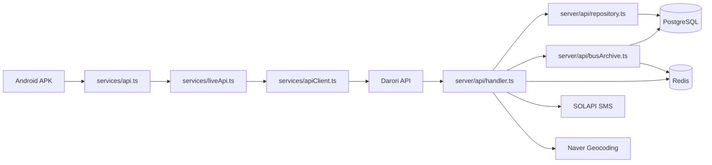
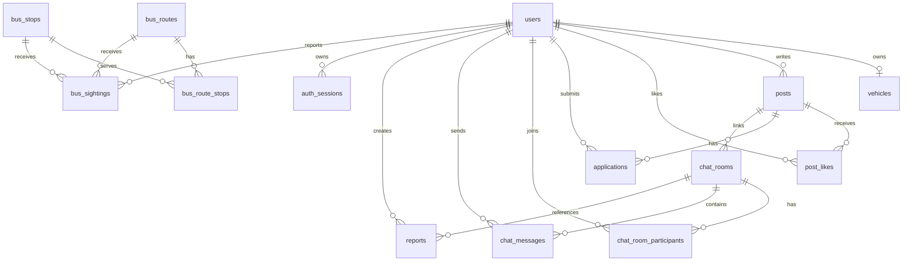

# Backend And API Reference

기준일: 2026-05-27
기준 코드: `server/`, `api/`, `server/db/schema.sql`, `types/domain.ts`

이 문서는 Android APK가 호출하는 Darori API 서버를 기준으로 DB 스키마, 백엔드 구조, API 명세를 한 곳에 정리한다. APK는 PostgreSQL/Redis에 직접 연결하지 않고 `EXPO_PUBLIC_DARORI_API_BASE_URL`의 HTTP API만 호출한다.

## Runtime Overview



## Backend Structure

| Path | Role |
| --- | --- |
| `server/api/server.ts` | Local/EC2 Node HTTP server. `PORT` 기본값은 `8787`. |
| `api/index.ts`, `api/[...path].ts` | Vercel Function entrypoint. `/api/*` 요청을 shared handler로 전달한다. |
| `server/api/handler.ts` | HTTP 라우팅, JSON body parsing, CORS, 에러 응답, auth/rate-limit 적용 지점. |
| `server/api/auth.ts` | Bearer token 또는 개발용 `X-Darori-User-Id`를 `RequestContext`로 변환한다. |
| `server/api/repository.ts` | 사용자, 인증 세션, 게시글, 지원, 채팅, 신고의 PostgreSQL repository. |
| `server/api/busArchive.ts` | 버스 노선/정류장/목격 기록 API와 Redis latest-sighting cache. |
| `server/api/phoneVerification.ts` | 휴대폰 인증 코드 생성, 해시 저장, 확인, signup proof 소비. |
| `server/api/rateLimit.ts` | Redis `incr`/`expire` 기반 write API rate limit. |
| `server/maps/naverGeocode.ts` | 서버 전용 Naver Maps REST Geocoding proxy. |
| `server/sms/solapi.ts` | SOLAPI SMS 서명 생성과 발송 request 구성. |
| `server/db/*.ts` | DB config, PostgreSQL/Redis 연결, schema apply, migration, seed script. |
| `server/db/schema.sql` | 현재 전체 PostgreSQL schema source of truth. |

## Runtime Environment

### APK/Public

| Variable | Purpose |
| --- | --- |
| `EXPO_PUBLIC_DARORI_API_BASE_URL` | APK가 호출하는 API base URL. 현재 EAS `apk` profile은 `https://api.dairuri.harammm.me`. |
| `EXPO_PUBLIC_NAVER_MAP_NCP_KEY_ID` | Android Naver Maps native SDK key. |
| `EXPO_PUBLIC_DARORI_USE_MOCK_API` | 테스트/로컬 opt-in 전용. production build에서 `true`이면 앱이 error를 던진다. |

### Server-only

| Variable | Purpose |
| --- | --- |
| `DATABASE_URL` | PostgreSQL connection string. |
| `DATABASE_SSL`, `PGSSLMODE`, `POSTGRES_SSL` | PostgreSQL SSL 활성화 플래그. |
| `REDIS_URL` | Redis connection string. rate limit과 버스 latest-sighting cache에 사용한다. |
| `NAVER_MAP_API_KEY` | `/maps/geocode`에서 사용하는 서버 전용 Naver Maps REST API key. |
| `SOLAPI_API_KEY`, `SOLAPI_API_SECRET`, `SOLAPI_FROM` | 휴대폰 인증 SMS 발송 설정. |
| `PHONE_VERIFICATION_HASH_SECRET` | 인증 코드/token 해시 salt. |
| `PHONE_VERIFICATION_DEBUG_CODE_ENABLED` | true이면 인증 코드가 API 응답에 포함될 수 있다. production 임시 테스트 외에는 끈다. |
| `DARORI_ALLOW_DEV_USER_HEADER` | true이면 `X-Darori-User-Id` fallback 인증을 허용한다. production에서는 끈다. |
| `DARORI_RATE_LIMIT_DISABLED` | true이면 write API rate limit을 끈다. 로컬 디버그 전용. |
| `DARORI_REPORTER_LABEL_SALT` | 버스 목격 reporter label 익명화 salt. production은 32자 이상 random 값 권장. |

## Authentication

기본 인증 방식은 `Authorization: Bearer <session token>`이다.

- `POST /auth/signup`, `POST /auth/login`이 `AuthSession`을 반환한다.
- 클라이언트는 token을 `services/authSession.ts`에 보관하고 `services/apiClient.ts`가 헤더에 붙인다.
- 서버는 token을 SHA-256 해시로 변환해 `auth_sessions.token_hash`와 비교한다.
- 만료된 session 또는 존재하지 않는 token은 인증 실패로 처리한다.
- 개발용 `X-Darori-User-Id`는 `NODE_ENV=test` 또는 `DARORI_ALLOW_DEV_USER_HEADER=true`일 때만 허용된다.

## Rate Limits

`server/api/handler.ts`의 write action별 Redis rate limit:

| Action | Limit | Window |
| --- | ---: | ---: |
| auth/signup/login/phone verification | 10 | 60s |
| createPost | 20 | 60s |
| toggleLike | 120 | 60s |
| createApplication | 10 | 60s |
| reviewApplication | 60 | 60s |
| sendChatMessage | 60 | 60s |
| submitReport | 10 | 60s |
| recordBusSighting | 30 | 60s |

초과 시 `429`와 `Retry-After` header를 반환한다.

## Database Schema

### Enums

| Enum | Values | Used by |
| --- | --- | --- |
| `post_type` | `job`, `carpool` | `posts.type` |
| `post_status` | `open`, `closed` | `posts.status` |
| `application_status` | `pending`, `accepted`, `rejected` | `applications.status` |
| `driver_type` | `driver`, `non_driver` | `users.driver_type` |
| `chat_message_type` | `system`, `text` | `chat_messages.type` |

### Tables

| Table | Key Columns | Notes |
| --- | --- | --- |
| `users` | `id`, `nickname`, `real_name`, `phone`, `email`, `password_hash`, `avatar_url`, `area`, `temperature`, `driver_type`, `created_at`, `updated_at` | 사용자 계정. `phone` unique, `email` unique. |
| `phone_verifications` | `id`, `phone`, `code_hash`, `verified_token_hash`, `attempts`, `expires_at`, `verified_at`, `consumed_at`, `created_at` | signup 전 휴대폰 인증 상태. proof는 회원가입 시 consumed 처리된다. |
| `vehicles` | `id`, `user_id`, `plate_number`, `model_name`, `image_urls`, `created_at` | 운전자 차량 정보. `users` 삭제 시 cascade. |
| `posts` | `id`, `type`, `title`, `body`, `author_id`, `image_urls`, `status`, `place_name`, `place_address`, `departure`, `destination`, `days`, `start_time`, `end_time`, `wage_type`, `wage_amount`, `job_category`, `profile_mode`, `available_tasks`, `employment_types`, `preferred_pay`, `availability_note`, `contact_note`, `price`, `seats`, `created_at`, `updated_at` | 카풀/인력 게시글 공용 테이블. `job`은 `place_name`, `wage_amount` 필수. `carpool`은 `departure`, `destination` 필수. |
| `post_likes` | `post_id`, `user_id`, `created_at` | 게시글 찜. PK는 `(post_id, user_id)`. |
| `applications` | `id`, `post_id`, `applicant_id`, `intro`, `status`, `rejection_reason`, `created_at`, `updated_at` | 게시글 지원. `(post_id, applicant_id)` unique. |
| `chat_rooms` | `id`, `post_id`, `title`, `subtitle`, `created_at`, `updated_at` | 지원 승인 후 생성되는 채팅방. |
| `chat_room_participants` | `room_id`, `user_id`, `last_read_at`, `created_at` | 채팅방 참여자. PK는 `(room_id, user_id)`. |
| `chat_messages` | `id`, `room_id`, `sender_id`, `type`, `text`, `created_at` | 채팅 메시지. `type='text'`이면 `text` 필수. |
| `reports` | `id`, `reporter_id`, `room_id`, `reported_user_id`, `reason`, `created_at` | 채팅방 신고. |
| `auth_sessions` | `id`, `user_id`, `token_hash`, `expires_at`, `revoked_at`, `created_at` | Bearer session 저장소. token 원문은 저장하지 않는다. |
| `bus_routes` | `id`, `code`, `name`, `color`, `created_at` | 버스 노선. `code` unique. |
| `bus_stops` | `id`, `name`, `latitude`, `longitude`, `created_at` | 버스 정류장. |
| `bus_route_stops` | `route_id`, `stop_id`, `sequence` | 노선-정류장 순서. PK는 `(route_id, stop_id)`, `(route_id, sequence)` unique. |
| `bus_sightings` | `id`, `route_id`, `stop_id`, `reporter_id`, `latitude`, `longitude`, `created_at` | 사용자 버스 목격 기록. reporter 삭제 시 `reporter_id`는 null. |

### Relationships



### Indexes

| Index | Purpose |
| --- | --- |
| `posts_type_status_created_at_idx` | 게시글 타입/상태별 최신순 조회. |
| `applications_post_status_idx` | 게시글별 지원 상태 조회. |
| `applications_post_applicant_unique_idx` | 같은 사용자의 중복 지원 방지. |
| `chat_messages_room_created_at_idx` | 채팅방 메시지 시간순 조회. |
| `auth_sessions_user_id_idx`, `auth_sessions_expires_at_idx` | 세션 사용자/만료 조회. |
| `phone_verifications_phone_created_at_idx`, `phone_verifications_expires_at_idx` | 휴대폰 인증 조회/만료 관리. |
| `bus_sightings_stop_created_at_idx`, `bus_sightings_route_created_at_idx` | 정류장/노선별 최신 목격 조회. |

## API Conventions

- Request/response body는 JSON이다.
- 성공 응답은 entity 또는 array를 JSON으로 반환한다.
- `204` 응답은 body가 없다.
- 에러 응답 형식은 `{ "error": "message" }`이다.
- CORS 허용 header는 `Content-Type`, `Accept`, `Authorization`, `X-Darori-User-Id`.

## API Endpoints

| Method | Path | Auth | Body | Success |
| --- | --- | --- | --- | --- |
| `GET` | `/health` | none | none | `200 { ok: true }` |
| `POST` | `/auth/phone-verifications` | none, rate limited | `{ phone }` | `201 PhoneVerificationStartResult` |
| `POST` | `/auth/phone-verifications/:id/confirm` | none, rate limited | `{ code }` | `200 PhoneVerificationConfirmResult` |
| `POST` | `/auth/signup` | none, rate limited | `SignupInput` | `201 AuthSession` |
| `POST` | `/auth/login` | none, rate limited | `LoginInput` | `200 AuthSession` |
| `GET` | `/me` | required | none | `200 UserProfile` |
| `PATCH` | `/me` | required | `UpdateUserProfileInput` | `200 UserProfile` |
| `PATCH` | `/me/password` | required, rate limited | `ChangePasswordInput` | `204` |
| `DELETE` | `/me` | required, rate limited | none | `204` |
| `GET` | `/me/posts` | required | none | `200 Post[]` |
| `GET` | `/me/saved-posts` | required | none | `200 Post[]` |
| `GET` | `/me/received-applications` | required | none | `200 ApplicationDetail[]` |
| `GET` | `/posts` | optional bearer | none | `200 Post[]` |
| `POST` | `/posts` | required, rate limited | `Partial<Post>` | `201 Post` |
| `GET` | `/posts/:id` | optional bearer | none | `200 Post` |
| `POST` | `/posts/:id/like` | required, rate limited | none | `200 Post` |
| `GET` | `/posts/:id/applications` | required | none | `200 Application[]` |
| `POST` | `/posts/:id/applications` | required, rate limited | `{ intro }` | `201 Application` |
| `GET` | `/applications/:id` | required | none | `200 ApplicationDetail` |
| `POST` | `/applications/:id/accept` | required, rate limited | none | `200 ChatRoom` |
| `POST` | `/applications/:id/reject` | required, rate limited | `{ reason }` | `204` |
| `GET` | `/chat/rooms` | required | none | `200 ChatRoom[]` |
| `GET` | `/chat/rooms/:roomId/messages` | required | none | `200 ChatMessage[]` |
| `POST` | `/chat/rooms/:roomId/messages` | required, rate limited | `{ text }` | `201 ChatMessage` |
| `POST` | `/reports` | required, rate limited | `{ roomId, reason }` | `201 Report` |
| `GET` | `/bus/routes` | none | none | `200 BusRoute[]` |
| `GET` | `/bus/stops` | none | none | `200 BusStop[]` |
| `GET` | `/bus/route-stops` | none | none | `200 BusRouteStop[]` |
| `GET` | `/bus/stops/:id/sightings?limit=20` | none | none | `200 BusSighting[]` |
| `POST` | `/bus/sightings` | required, rate limited | `RecordBusSightingInput` | `201 BusSighting` |
| `GET` | `/maps/geocode?query=...` | none | none | `200 PlaceCandidate[]` |

## Main DTOs

| Type | Shape |
| --- | --- |
| `AuthSession` | `{ token, user: UserProfile }` |
| `UserProfile` | `{ id, nickname, realName?, phone?, email?, avatarUrl?, area?, temperature, driverType, vehicle? }` |
| `SignupInput` | `{ nickname, realName?, phone, email?, password, driverType, vehicle?, phoneVerification }` |
| `PhoneVerificationStartResult` | `{ verificationId, expiresAt, debugCode? }` |
| `PhoneVerificationConfirmResult` | `{ verificationId, phone, verifiedToken, verifiedAt }` |
| `Post` | `CarpoolPost` or `JobPost` from `types/domain.ts`. |
| `Application` | `{ id, postId, applicant, intro, status, createdAt, rejectionReason? }` |
| `ApplicationDetail` | `{ application, post }` |
| `ChatRoom` | `{ id, title, subtitle?, participants, postId?, lastMessage?, unreadCount }` |
| `ChatMessage` | `{ id, roomId, senderId?, type, text?, createdAt, post? }` |
| `Report` | `{ id, roomId?, reason, createdAt }` |
| `BusRoute` | `{ id, code, name, color, lastSightingAt? }` |
| `BusStop` | `{ id, name, latitude, longitude, lastSightingAt? }` |
| `BusSighting` | `{ id, routeId, stopId, reporterLabel, latitude, longitude, createdAt }` |

## Local Operations

```bash
docker compose up -d
npm run db:check
npm run db:migrate
npm run db:seed
npm run api:start
```

Schema reset for disposable local data:

```bash
npm run db:reset
```

APK-facing local app config:

```bash
EXPO_PUBLIC_DARORI_API_BASE_URL=http://localhost:8787 npm run android
```
