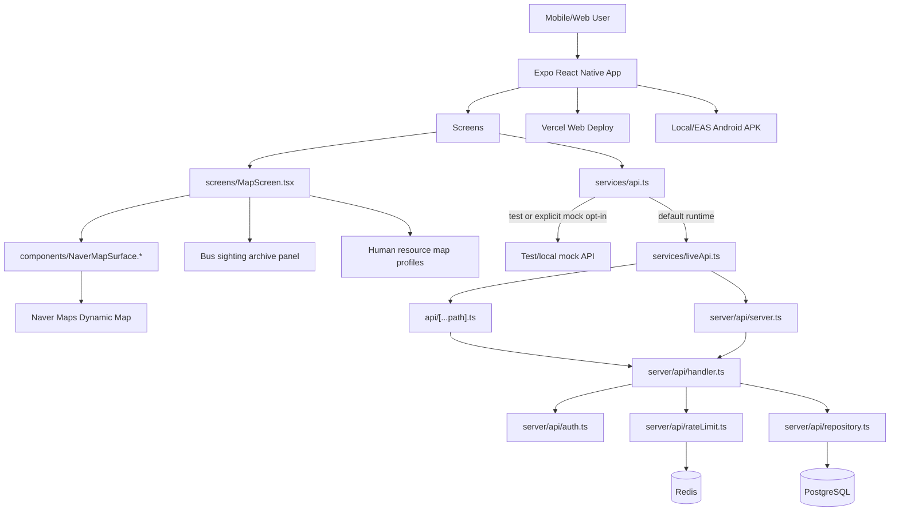
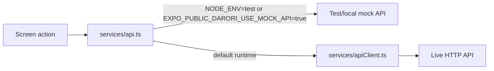
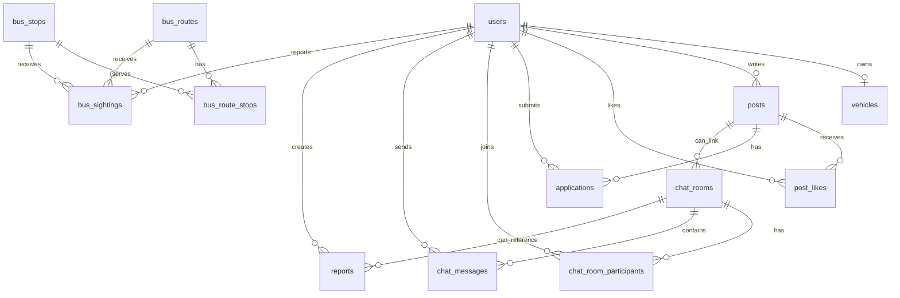

# Current Architecture

기준: `feat/map-bus-sighting-archive` 브랜치의 현재 코드. 웹 배포는 Vercel의 Expo web export 흐름을 사용하며, Android APK/EAS 설정은 별도 PR `feat/android-apk-build-profile`에 있다.

## High-Level Architecture

## App Layer

| Area | Files | Role |
| --- | --- | --- |
| Entry | `index.ts`, `App.tsx` | Expo entry and root screen/tab orchestration |
| Screens | `screens/*.tsx` | Map, route/bus, archive, human-resource registration, chat, profile flows |
| Components | `components/*.tsx` | Shared UI controls, bottom nav, cards, native/web map surfaces |
| Domain types | `types/domain.ts` | Shared app/domain model types |
| Test/local data | `data/mockDomain.ts`, `data/mapHome.ts` | Fixture source for Jest and explicit local mock mode |
| List helpers | `data/mapPostList.ts` | Shared map/archive filtering, sorting, paging |
| Design tokens | `constants/*.ts` | Colors, spacing, typography |

## API Client Flow

The app defaults to live API mode. If `EXPO_PUBLIC_DARORI_API_BASE_URL` is missing outside tests, live calls fail loudly instead of silently reading mock data. Mock mode is available only in Jest or with `EXPO_PUBLIC_DARORI_USE_MOCK_API=true` for controlled local demos.

Live requests can include:

- `EXPO_PUBLIC_DARORI_API_BASE_URL`: API server base URL. Local server uses `http://localhost:8787`; same-origin Vercel web deploy can use `/api`.
- `EXPO_PUBLIC_DARORI_USER_ID`: sent as `X-Darori-User-Id` for write requests.

These names are current code-level identifiers. The user context is still a development contract, not production-grade auth.

## Map Layer

The map home screen uses two implementations behind the same UI surface:

| Target | Files | Behavior |
| --- | --- | --- |
| Native | `components/NaverMapSurface.tsx` | Uses `@mj-studio/react-native-naver-map` and native Dynamic Map key configuration |
| Web | `components/NaverMapSurface.web.tsx` | Loads the Naver Web Dynamic Map script with `EXPO_PUBLIC_NAVER_MAP_WEB_NCP_KEY_ID` |
| Fallback | `components/FallbackMapSurface.tsx` | Draws a lightweight local map-like view when the real map cannot be used |

`screens/MapScreen.tsx` owns the map camera state, category chips, current-location button, recruitment/resource bottom sheet, and the bus sighting archive panel. The `work` category currently represents the human-resource map: job seekers register possible tasks, availability, and preferred conditions so local residents or employers can discover and contact them. The current-location button asks the browser/native geolocation API for permission, moves the map camera, and falls back to the default campus coordinate when location is unavailable.

## Server API

Server entrypoints:

- Local long-running HTTP server: `server/api/server.ts`
- Vercel Function catch-all: `api/[...path].ts`
- Shared request handler: `server/api/handler.ts`

| Route | Auth | Rate limit | Repository action |
| --- | --- | --- | --- |
| `GET /health` | no | no | none |
| `GET /posts` | optional user header | no | `listPosts(viewerUserId)` |
| `GET /posts/:id` | optional user header | no | `getPostById(id, viewerUserId)` |
| `POST /posts` | required | yes | `createPost(body, userId)` |
| `POST /posts/:id/like` | required | yes | `togglePostLike(postId, userId)` |
| `POST /posts/:id/applications` | required | yes | `createApplication(postId, intro, userId)` |
| `POST /applications/:id/accept` | required | yes | `updateApplicationStatus(id, "accepted")` |
| `POST /applications/:id/reject` | required | yes | `updateApplicationStatus(id, "rejected", reason)` |
| `GET /bus/routes` | no | no | `listBusRoutes()` |
| `GET /bus/stops` | no | no | `listBusStops()` |
| `GET /bus/route-stops` | no | no | `listBusRouteStops()` |
| `GET /bus/stops/:id/sightings` | no | no | `listSightingsForStop(stopId, limit)` |
| `POST /bus/sightings` | required | yes | `recordBusSighting(body, userId)` |
| `GET /chat/rooms` | no | no | `listChatRooms()` |
| `GET /chat/rooms/:roomId/messages` | no | no | `listChatMessages(roomId)` |
| `POST /chat/rooms/:roomId/messages` | required | yes | `createChatMessage(roomId, text, userId)` |

Auth behavior:

- `server/api/auth.ts` reads `X-Darori-User-Id`.
- Write endpoints return `401` when the header is missing or invalid.
- Read endpoints can use the header only to calculate viewer-specific fields such as `liked`.

Rate limit behavior:

- `server/api/rateLimit.ts` uses Redis-style `incr` + `expire`.
- Server returns `429` with `Retry-After` when exceeded.
- `DARORI_RATE_LIMIT_DISABLED=true` can disable it for controlled local debugging.

## Data Layer

Main schema file: `server/db/schema.sql`

Durable PostgreSQL tables:

- `users`
- `vehicles`
- `posts`
- `post_likes`
- `applications`
- `chat_rooms`
- `chat_room_participants`
- `chat_messages`
- `reports`
- `bus_routes`
- `bus_stops`
- `bus_route_stops`
- `bus_sightings`

The `posts` table includes human-resource profile columns for the `work` map pivot: `profile_mode`, `available_tasks`, `employment_types`, `preferred_pay`, `availability_note`, and `contact_note`.

Migration tracking:

- `schema_migrations` is created by `server/db/migrate.ts`.
- `npm run db:migrate` applies pending schema migrations.
- `npm run db:reset` drops app tables/types and reapplies schema + seed.

Redis usage:

- rate limit counters for write endpoints.
- bus stop latest-sighting cache.
- planned future usage: token denylist, verification nonce, presence, unread cache, map/directions cache.

## Build And Deployment

| Target | Current path |
| --- | --- |
| Web production | Vercel uses `vercel.json` to run `npx expo export --platform web --output-dir dist` |
| API production | Vercel serves `api/[...path].ts` under `/api/*`, or `npm run api:start` can run the same handler on a separate Node host |
| Web local | `npm run web` |
| API local | `npm run api:start` |
| DB local | `docker-compose.yml` runs PostgreSQL on `54320`, Redis on `63790` |
| Android APK | APK profile is in PR #14. Local artifact was copied to `~/Downloads/dairuri.apk` |

## Environment Variables

| Variable | Used by | Required for |
| --- | --- | --- |
| `EXPO_PUBLIC_DARORI_API_BASE_URL` | app client | live API mode |
| `EXPO_PUBLIC_DARORI_USER_ID` | app client | development write user header |
| `EXPO_PUBLIC_DARORI_USE_MOCK_API` | app client | test/local mock opt-in only |
| `EXPO_PUBLIC_NAVER_MAP_NCP_KEY_ID` | Expo app / native map | public native Dynamic Map key fallback |
| `EXPO_PUBLIC_NAVER_MAP_WEB_NCP_KEY_ID` | web map surface | Naver Web Dynamic Map script auth |
| `NAVER_MAP_NCP_KEY_ID` | Expo config | native Naver map client id |
| `NAVER_MAP_API_KEY` | server API | Naver REST APIs such as geocoding/directions |
| `DATABASE_URL` | server DB | PostgreSQL access |
| `REDIS_URL` | server API | rate limiting / Redis access |
| `DATABASE_SSL` / `PGSSLMODE` / `POSTGRES_SSL` | server DB | production SSL config |
| `DARORI_API_PORT` | server API | local API port override |
| `DARORI_RATE_LIMIT_DISABLED` | server API | controlled local rate-limit bypass |

## Current Gaps

These are not finished yet:

- Real auth token/session verification. Current write auth is a development header contract.
- Application review still reads seeded fixture data until an application-list/detail endpoint exists.
- Profile edit/settings still read the local development user fixture until user profile endpoints exist.
- Role/ownership checks for accepting or rejecting applications.
- Production `DATABASE_URL` and `REDIS_URL` verification against real infrastructure.
- Production Naver Maps domain/environment verification for the final deployment URL.
- App UI for real login session propagation into `EXPO_PUBLIC_DARORI_USER_ID` replacement.
- Branding cleanup across `app.config.js`, environment variable names, fixtures, and reference docs after the public name is final.
