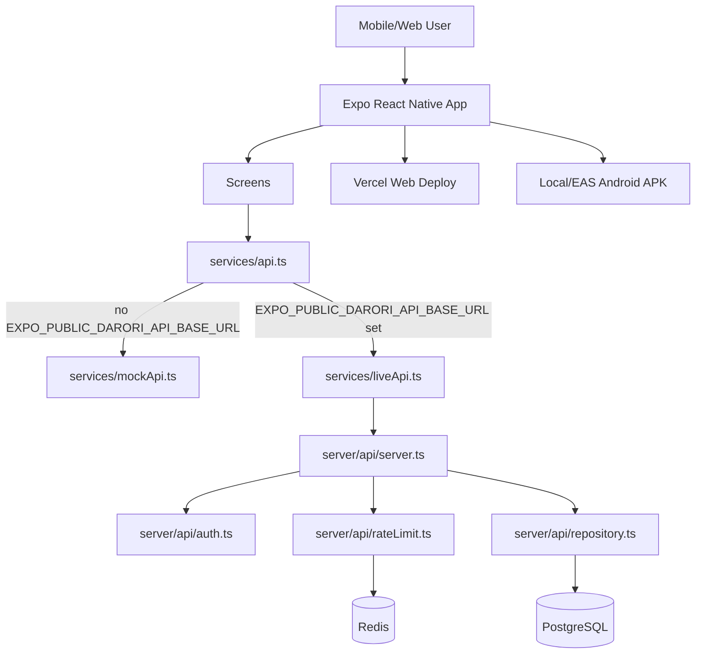
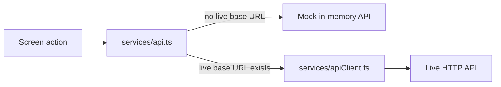
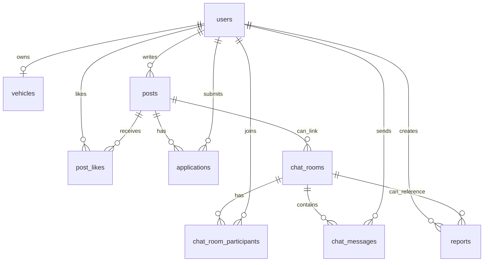

# Darori Current Structure

기준: `feat/api-auth-rate-limit` 브랜치의 현재 코드. Android APK/EAS 설정은 별도 PR `feat/android-apk-build-profile`에 있다.

## High-Level Architecture

## App Layer

| Area | Files | Role |
| --- | --- | --- |
| Entry | `index.ts`, `App.tsx` | Expo entry and root screen/tab orchestration |
| Screens | `screens/*.tsx` | Map, archive, route, create post, chat, profile flows |
| Components | `components/*.tsx` | Shared UI controls, bottom nav, cards, map preview |
| Domain types | `types/domain.ts` | Shared app/domain model types |
| Mock data | `data/mockDomain.ts`, `data/mapHome.ts` | Local fixture source for mock mode and UI demos |
| List helpers | `data/mapPostList.ts` | Shared map/archive filtering, sorting, paging |
| Design tokens | `constants/*.ts` | Colors, spacing, typography |

## API Client Flow

The app defaults to mock mode. Live mode is enabled only when `EXPO_PUBLIC_DARORI_API_BASE_URL` exists.

Live requests can include:

- `EXPO_PUBLIC_DARORI_API_BASE_URL`: API server base URL.
- `EXPO_PUBLIC_DARORI_USER_ID`: sent as `X-Darori-User-Id` for write requests.

This is still a development user context, not production-grade auth.

## Server API

Server entrypoint: `server/api/server.ts`

| Route | Auth | Rate limit | Repository action |
| --- | --- | --- | --- |
| `GET /health` | no | no | none |
| `GET /posts` | optional user header | no | `listPosts(viewerUserId)` |
| `GET /posts/:id` | optional user header | no | `getPostById(id, viewerUserId)` |
| `POST /posts` | required | yes | `createPost(body, userId)` |
| `POST /posts/:id/like` | required | yes | `togglePostLike(postId, userId)` |
| `POST /posts/:id/applications` | required | yes | `createApplication(postId, intro, userId)` |
| `POST /applications/:id/accept` | required | yes | `updateApplicationStatus(id, "accepted")` |
| `POST /applications/:id/reject` | required | yes | `updateApplicationStatus(id, "rejected", reason)` |
| `GET /chat/rooms` | no | no | `listChatRooms()` |
| `GET /chat/rooms/:roomId/messages` | no | no | `listChatMessages(roomId)` |
| `POST /chat/rooms/:roomId/messages` | required | yes | `createChatMessage(roomId, text, userId)` |

Auth behavior:

- `server/api/auth.ts` reads `X-Darori-User-Id`.
- Write endpoints return `401` when the header is missing or invalid.
- Read endpoints can use the header only to calculate viewer-specific fields such as `liked`.

Rate limit behavior:

- `server/api/rateLimit.ts` uses Redis-style `incr` + `expire`.
- Server returns `429` with `Retry-After` when exceeded.
- `DARORI_RATE_LIMIT_DISABLED=true` can disable it for controlled local debugging.

## Data Layer

Main schema file: `server/db/schema.sql`

Durable PostgreSQL tables:

- `users`
- `vehicles`
- `posts`
- `post_likes`
- `applications`
- `chat_rooms`
- `chat_room_participants`
- `chat_messages`
- `reports`

Migration tracking:

- `schema_migrations` is created by `server/db/migrate.ts`.
- `npm run db:migrate` applies pending schema migrations.
- `npm run db:reset` drops app tables/types and reapplies schema + seed.

Redis usage:

- rate limit counters for write endpoints.
- planned future usage: token denylist, verification nonce, presence, unread cache, map/directions cache.

## Build And Deployment

| Target | Current path |
| --- | --- |
| Web production | Vercel uses `vercel.json` to run `npx expo export --platform web --output-dir dist` |
| Web local | `npm run web` |
| API local | `npm run api:start` |
| DB local | `docker-compose.yml` runs PostgreSQL on `54320`, Redis on `63790` |
| Android APK | APK profile is in PR #14. Local artifact was copied to `~/Downloads/dairuri.apk` |

## Environment Variables

| Variable | Used by | Required for |
| --- | --- | --- |
| `EXPO_PUBLIC_DARORI_API_BASE_URL` | app client | live API mode |
| `EXPO_PUBLIC_DARORI_USER_ID` | app client | development write user header |
| `DATABASE_URL` | server DB | PostgreSQL access |
| `REDIS_URL` | server API | rate limiting / Redis access |
| `DATABASE_SSL` / `PGSSLMODE` / `POSTGRES_SSL` | server DB | production SSL config |
| `DARORI_API_PORT` | server API | local API port override |
| `DARORI_RATE_LIMIT_DISABLED` | server API | controlled local rate-limit bypass |
| `NAVER_MAP_NCP_KEY_ID` | Expo config | native Naver map client id |

## Current Gaps

These are not finished yet:

- Real auth token/session verification. Current write auth is a development header contract.
- Role/ownership checks for accepting or rejecting applications.
- Production migration history beyond the current initial schema migration.
- Production `DATABASE_URL` and `REDIS_URL` verification against real infrastructure.
- App UI for real login session propagation into `EXPO_PUBLIC_DARORI_USER_ID` replacement.
