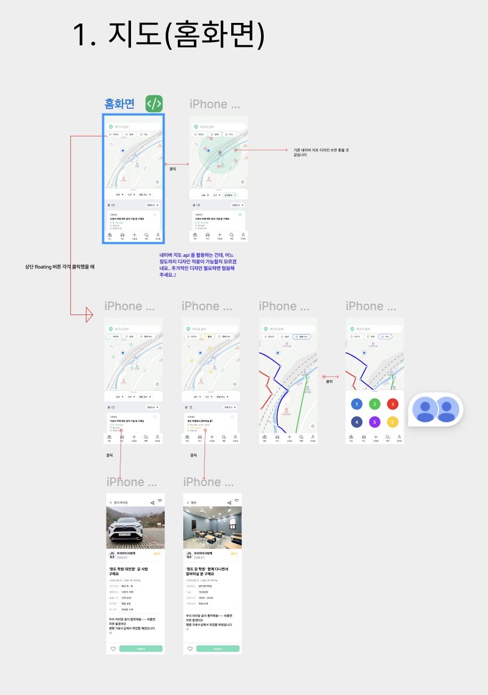
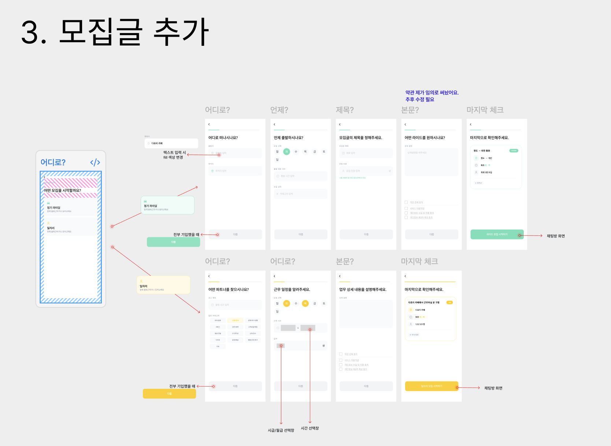
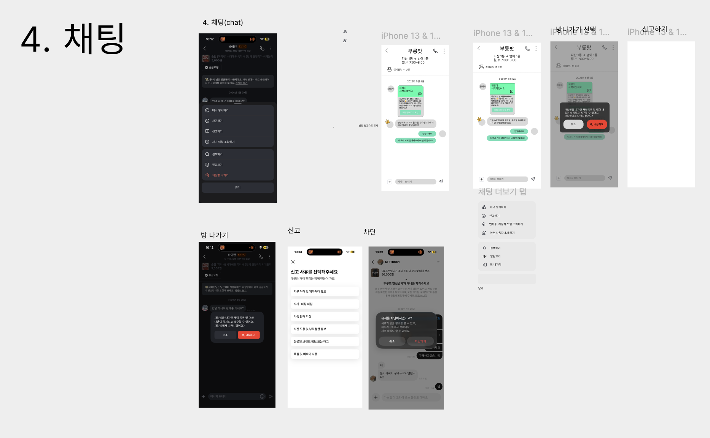
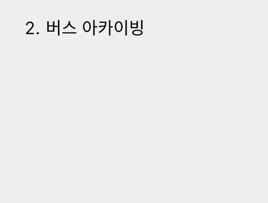
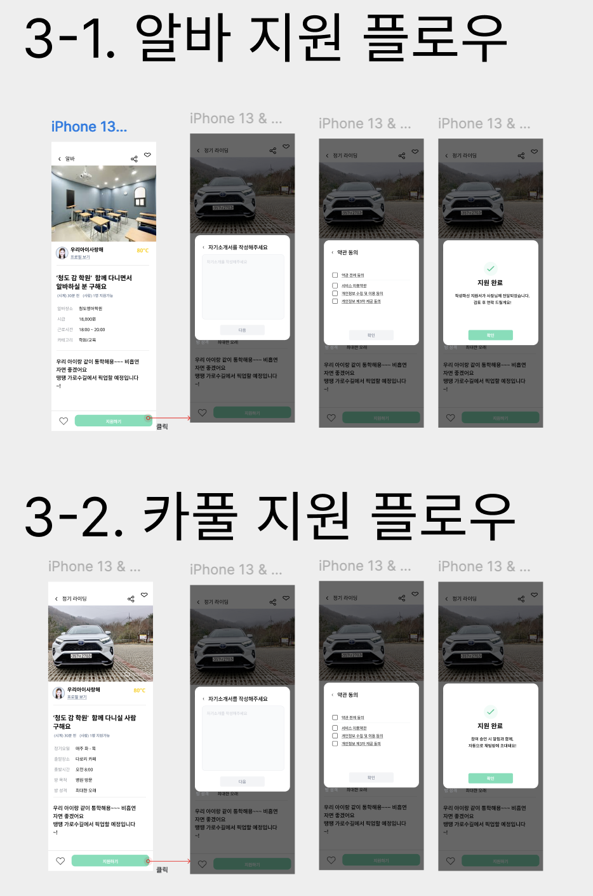
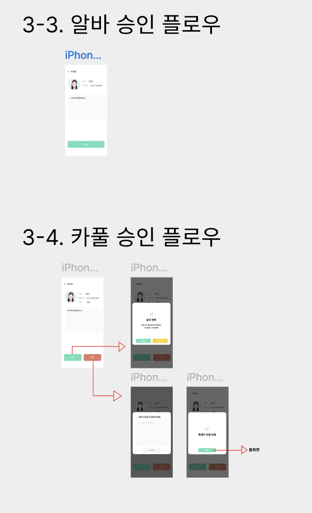
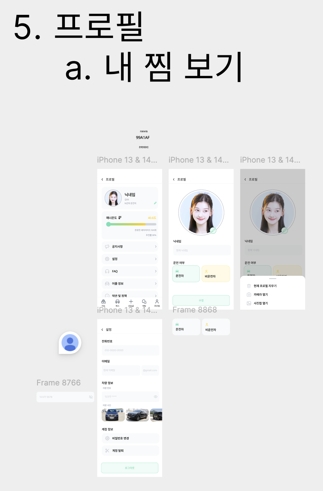
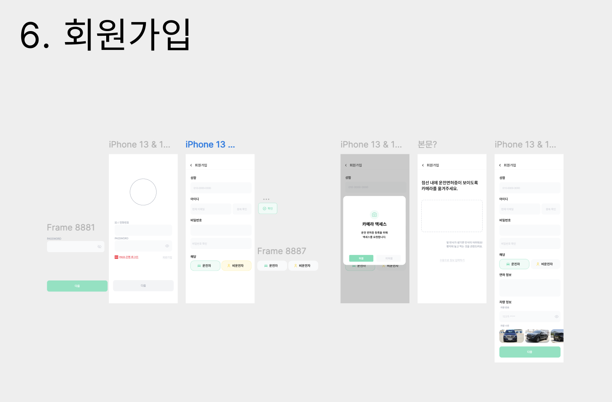

# 다로리(Darori) 앱 프론트엔드 화면 단위 구현 명세서

> Codex 입력용 구현 명세서입니다. 이 문서는 사용자가 제공한 Figma 와이어프레임 스크린샷을 기준으로, Expo/React Native/TypeScript 앱에서 화면을 재현하기 위한 구조, 화면별 UI 요소, 상태, 플로우, 라우팅, 데이터 타입, 공통 컴포넌트, 코드 스켈레톤을 포함합니다.

---

## 0. 구현 전제

### 0.1 목표

- Figma 스크린샷 기준으로 모바일 앱 프론트엔드를 구현한다.
- 화면 전체를 PNG로 박지 않는다. 이미지/지도/프로필/차량 사진 등 에셋만 이미지로 사용하고, 버튼/텍스트/입력창/카드/탭/모달은 React Native 컴포넌트로 구현한다.
- 우선 MVP 수준으로 모든 화면과 플로우가 동작하도록 만든다.
- 백엔드가 없으면 mock data와 mock API를 사용한다.
- 디자인 기준은 iPhone 13/14 계열 화면을 기준으로 한다.

### 0.2 기술 스택 가정

기존 프로젝트가 있다면 기존 구조를 최대한 유지한다. 새로 만든다면 아래를 기준으로 한다.

```txt
Framework: Expo + React Native + TypeScript
Routing: Expo Router
State: React state + Context 또는 Zustand
Server data: mock service 우선, 추후 React Query 연결 가능
Map: 프로젝트에 설치된 Naver Map SDK wrapper 또는 임시 placeholder map
Icons: 프로젝트에 설치된 아이콘 패키지 사용, 없으면 lucide-react-native 또는 Ionicons 계열 사용
Styling: StyleSheet 또는 styled-components 중 프로젝트 기준 선택. 새 프로젝트면 StyleSheet 사용
```

### 0.3 디자인 기준 해상도

```ts
export const DESIGN_WIDTH = 390;
export const DESIGN_HEIGHT = 844;
```

- 모든 화면은 `SafeAreaView` 기준으로 구현한다.
- 하단 탭이 있는 화면은 `paddingBottom: bottomTabHeight + safeAreaBottom`을 고려한다.
- 고정 하단 버튼이 있는 화면은 `position: 'absolute'`보다 `SafeAreaView + footer container`를 우선 사용한다.
- absolute positioning은 지도 마커, floating button, bottom sheet overlay처럼 필요한 곳에만 사용한다.

### 0.4 참고 이미지

Codex가 이미지 reference를 확인할 수 있도록 이 문서와 같은 폴더의 `images/`에 넣었다.

| 구분 | 이미지 |
|---|---|
| 전체 Figma 보드 | `images/00_figma_overview.png` |
| 1. 지도/홈 | `images/01_map_home.png` |
| 2. 버스 아카이빙 | `images/02_bus_archiving.png` |
| 3. 모집글 추가 | `images/03_create_post.png` |
| 3-1/3-2 지원 플로우 | `images/04_application_flows.png` |
| 3-3/3-4 승인 플로우 | `images/05_approval_flows.png` |
| 4. 채팅 | `images/06_chat.png` |
| 5. 프로필/내 찜/설정 | `images/07_profile.png` |
| 6. 회원가입 | `images/08_signup.png` |







---

## 1. 앱 정보 구조

### 1.1 하단 탭

하단 탭은 대부분의 메인 화면에 공통으로 표시한다.

```txt
홈 / 버스 / 모집 / 채팅 / 프로필
```

중앙 `모집` 탭은 `+` 아이콘 또는 강조된 메뉴처럼 보이게 한다.

### 1.2 라우트 구조

Expo Router 기준 권장 구조:

```txt
app/
  _layout.tsx
  index.tsx
  auth/
    login.tsx
    signup.tsx
    camera-permission.tsx
    license-upload.tsx
  (tabs)/
    _layout.tsx
    home.tsx
    bus.tsx
    create.tsx
    chat.tsx
    profile.tsx
  posts/
    [id].tsx
    create/
      index.tsx
      type.tsx
      carpool/
        destination.tsx
        schedule.tsx
        title.tsx
        body.tsx
        confirm.tsx
      job/
        place.tsx
        schedule.tsx
        body.tsx
        confirm.tsx
  apply/
    [postId].tsx
  approval/
    [applicationId].tsx
  chat/
    [roomId].tsx
    report.tsx
  profile/
    edit.tsx
    settings.tsx
```

기존 프로젝트가 `src/screens` 기반이면 아래처럼 대응한다.

```txt
src/
  screens/
    Home/MapHomeScreen.tsx
    Bus/BusArchiveScreen.tsx
    Post/CreatePostTypeScreen.tsx
    Post/CreateCarpool*.tsx
    Post/CreateJob*.tsx
    Post/PostDetailScreen.tsx
    Apply/ApplyModalFlow.tsx
    Approval/ApplicationReviewScreen.tsx
    Chat/ChatListScreen.tsx
    Chat/ChatRoomScreen.tsx
    Chat/ReportScreen.tsx
    Profile/ProfileHomeScreen.tsx
    Profile/ProfileEditScreen.tsx
    Profile/SettingsScreen.tsx
    Auth/SignupScreen.tsx
```

---

## 2. 디자인 토큰

### 2.1 색상

스크린샷 기준 근사값이다. 실제 Figma inspect 값이 있으면 반드시 그 값으로 교체한다.

```ts
// src/constants/design.ts
export const colors = {
  primary: '#7ADDB8',
  primaryDark: '#3BB989',
  primaryLight: '#EFFFF8',
  primaryBorder: '#A4EBCF',

  yellow: '#FFD84D',
  yellowDark: '#F5BE18',
  yellowLight: '#FFF8DA',

  danger: '#EF6A5B',
  dangerDark: '#E34D42',

  black: '#111111',
  text: '#1F1F1F',
  textSub: '#666666',
  textMuted: '#9A9A9A',
  textDisabled: '#C8C8C8',

  white: '#FFFFFF',
  bg: '#FFFFFF',
  screenBg: '#F8F8F8',
  inputBg: '#F7F7F7',
  cardBg: '#FFFFFF',
  line: '#EEEEEE',
  lineDark: '#D9D9D9',
  dim: 'rgba(0,0,0,0.55)',

  routeBlue: '#2563EB',
  routeGreen: '#22C55E',
  routeRed: '#EF4444',
  routePurple: '#6366F1',
  routePink: '#A855F7',
  routeYellow: '#EAB308',
};

export const spacing = {
  xs: 4,
  sm: 8,
  md: 12,
  lg: 16,
  xl: 20,
  xxl: 24,
  screenX: 20,
  sectionY: 24,
  bottomButton: 16,
};

export const radius = {
  xs: 6,
  sm: 8,
  md: 12,
  lg: 16,
  xl: 20,
  round: 999,
};

export const typography = {
  h1: { fontSize: 24, lineHeight: 32, fontWeight: '700' as const },
  h2: { fontSize: 20, lineHeight: 28, fontWeight: '700' as const },
  title: { fontSize: 18, lineHeight: 26, fontWeight: '700' as const },
  subtitle: { fontSize: 16, lineHeight: 24, fontWeight: '600' as const },
  body: { fontSize: 14, lineHeight: 21, fontWeight: '400' as const },
  bodyBold: { fontSize: 14, lineHeight: 21, fontWeight: '700' as const },
  caption: { fontSize: 12, lineHeight: 18, fontWeight: '400' as const },
  tiny: { fontSize: 10, lineHeight: 14, fontWeight: '400' as const },
};

export const layout = {
  bottomTabHeight: 64,
  headerHeight: 52,
  inputHeight: 48,
  buttonHeight: 52,
  smallButtonHeight: 40,
};
```

### 2.2 공통 스타일 규칙

```txt
- 페이지 배경: white 또는 #F8F8F8
- 카드 배경: white
- 카드 radius: 12~16
- 버튼 radius: 8~12
- 입력창 배경: #F7F7F7
- 입력창 높이: 48
- 하단 CTA 버튼 높이: 52
- Header 높이: 52
- Bottom tab 높이: 64 + safe area bottom
- 모달 dim: rgba(0,0,0,0.55)
```

---

## 3. 데이터 모델

### 3.1 사용자/프로필

```ts
export type DriverType = 'driver' | 'nonDriver';

export interface UserProfile {
  id: string;
  nickname: string;
  realName?: string;
  phone?: string;
  email?: string;
  avatarUrl?: string;
  area?: string;
  temperature: number;
  driverType: DriverType;
  vehicle?: VehicleInfo;
}

export interface VehicleInfo {
  plateNumber: string;
  modelName?: string;
  images: string[];
}
```

### 3.2 모집글

```ts
export type PostType = 'carpool' | 'job';
export type PostStatus = 'open' | 'closed' | 'matched';

export interface BasePost {
  id: string;
  type: PostType;
  title: string;
  body: string;
  author: UserProfile;
  imageUrls: string[];
  liked: boolean;
  status: PostStatus;
  createdAt: string;
}

export interface CarpoolPost extends BasePost {
  type: 'carpool';
  departure: string;
  destination: string;
  days: Weekday[];
  startTime: string;
  endTime?: string;
  price?: number;
  seats?: number;
}

export interface JobPost extends BasePost {
  type: 'job';
  placeName: string;
  placeAddress?: string;
  days: Weekday[];
  startTime: string;
  endTime: string;
  wageType: 'hourly' | 'monthly';
  wageAmount: number;
  jobCategory?: string;
}

export type Post = CarpoolPost | JobPost;
export type Weekday = '월' | '화' | '수' | '목' | '금' | '토' | '일';
```

### 3.3 지원/승인

```ts
export type ApplicationStatus = 'pending' | 'accepted' | 'rejected';

export interface Application {
  id: string;
  postId: string;
  applicant: UserProfile;
  intro: string;
  status: ApplicationStatus;
  createdAt: string;
  rejectionReason?: string;
}
```

### 3.4 채팅

```ts
export interface ChatRoom {
  id: string;
  title: string;
  subtitle?: string;
  participants: UserProfile[];
  postId?: string;
  lastMessage?: string;
  unreadCount: number;
}

export type ChatMessageType = 'text' | 'system' | 'postCard';

export interface ChatMessage {
  id: string;
  roomId: string;
  senderId?: string;
  type: ChatMessageType;
  text?: string;
  createdAt: string;
  post?: Post;
}
```

### 3.5 지도

```ts
export interface MapMarkerItem {
  id: string;
  postId?: string;
  type: 'job' | 'carpool' | 'place' | 'current';
  latitude: number;
  longitude: number;
  title?: string;
}

export interface RouteOption {
  id: string;
  label: string;
  color: string;
  coordinates: Array<{ latitude: number; longitude: number }>;
}
```

---

## 4. Mock 데이터

백엔드 연결 전 아래 mock을 사용한다.

```ts
// src/mocks/data.ts
import type { Post, UserProfile, ChatRoom, ChatMessage, Application } from '../types';

export const mockMe: UserProfile = {
  id: 'me',
  nickname: '닉네임',
  realName: '하람',
  phone: '010-0000-0000',
  email: 'test@example.com',
  avatarUrl: undefined,
  area: '비산초교앞',
  temperature: 40.6,
  driverType: 'driver',
  vehicle: {
    plateNumber: '123가 5678',
    modelName: 'SUV',
    images: [],
  },
};

export const mockAuthor: UserProfile = {
  id: 'u1',
  nickname: '우리마이사랑해',
  avatarUrl: undefined,
  area: '프로필 보기',
  temperature: 80,
  driverType: 'driver',
  vehicle: {
    plateNumber: '357나2703',
    modelName: '토요타 SUV',
    images: [],
  },
};

export const mockPosts: Post[] = [
  {
    id: 'job-1',
    type: 'job',
    title: '청도감 학원 함께 다니면서 알바하실 분 구해요',
    body: '우리 아이랑 같이 통학해요. 비흡연자면 좋겠어요. 매주 가능하신 분이면 좋습니다.',
    author: mockAuthor,
    imageUrls: [],
    liked: false,
    status: 'open',
    createdAt: new Date().toISOString(),
    placeName: '청도명어학원',
    placeAddress: '대구광역시',
    days: ['월', '수', '목'],
    startTime: '18:00',
    endTime: '20:00',
    wageType: 'hourly',
    wageAmount: 10000,
    jobCategory: '라이딩 교육',
  },
  {
    id: 'carpool-1',
    type: 'carpool',
    title: '청도감 학원 함께 다니실 사람 구해요',
    body: '정기적으로 같이 이동하실 분을 찾습니다. 아이 등하원 동행 가능하신 분 환영합니다.',
    author: mockAuthor,
    imageUrls: [],
    liked: false,
    status: 'open',
    createdAt: new Date().toISOString(),
    departure: '우리집 근처',
    destination: '청도감 학원',
    days: ['월', '수', '목'],
    startTime: '18:00',
    endTime: '20:00',
    price: 20000,
    seats: 1,
  },
];

export const mockApplications: Application[] = [
  {
    id: 'app-1',
    postId: 'carpool-1',
    applicant: mockMe,
    intro: '시간 약속 잘 지키고 아이와 안전하게 이동할 수 있습니다.',
    status: 'pending',
    createdAt: new Date().toISOString(),
  },
];

export const mockChatRooms: ChatRoom[] = [
  {
    id: 'room-1',
    title: '부릉팟',
    subtitle: '대신 1동 > 범어1동 / 화, 수 7:00~8:00',
    participants: [mockMe, mockAuthor],
    postId: 'carpool-1',
    lastMessage: '대리카 저희 집에서 6시에 만나면 될까요?',
    unreadCount: 1,
  },
];

export const mockMessages: ChatMessage[] = [
  {
    id: 'm1',
    roomId: 'room-1',
    type: 'system',
    text: '2026년 5월 5일',
    createdAt: new Date().toISOString(),
  },
  {
    id: 'm2',
    roomId: 'room-1',
    senderId: 'u1',
    type: 'text',
    text: '안녕하세요! 지원 내용 확인했습니다.',
    createdAt: new Date().toISOString(),
  },
  {
    id: 'm3',
    roomId: 'room-1',
    senderId: 'me',
    type: 'text',
    text: '네 감사합니다. 자세한 일정 알려주세요.',
    createdAt: new Date().toISOString(),
  },
];
```

---

## 5. 공통 컴포넌트 명세

### 5.1 Header / BackHeader

사용처: 상세, 작성 플로우, 채팅, 프로필 수정, 설정, 회원가입

```tsx
interface HeaderProps {
  title?: string;
  showBack?: boolean;
  onBack?: () => void;
  right?: React.ReactNode;
}
```

구현 규칙:

```txt
height: 52
paddingHorizontal: 16~20
left: back chevron 또는 empty spacer
center title: 14~16 bold
right icons: share, heart, more, phone 등
borderBottom: 필요 시 #EEEEEE
```

### 5.2 BottomTabBar

사용처: 홈, 버스, 채팅 목록, 프로필

```tsx
const tabs = [
  { key: 'home', label: '홈', icon: 'home' },
  { key: 'bus', label: '버스', icon: 'bus' },
  { key: 'create', label: '모집', icon: 'plus' },
  { key: 'chat', label: '채팅', icon: 'message' },
  { key: 'profile', label: '프로필', icon: 'user' },
];
```

UI:

```txt
- height: 64 + bottom safe area
- background: white
- borderTop: #EEEEEE
- icon 20~22
- label 10~11
- active color: #111111 또는 primary
- inactive color: #999999
```

### 5.3 PrimaryButton

```tsx
interface AppButtonProps {
  label: string;
  onPress?: () => void;
  disabled?: boolean;
  variant?: 'primary' | 'yellow' | 'danger' | 'ghost' | 'outline';
  size?: 'large' | 'medium' | 'small';
}
```

UI:

```txt
large: height 52, radius 8~12
medium: height 44
small: height 36
primary: bg #7ADDB8, text white
yellow: bg #FFD84D, text white 또는 #111
danger: bg #EF6A5B, text white
disabled: bg #F0F0F0, text #C8C8C8
outline: border #7ADDB8, text #3BB989, bg white
```

### 5.4 TextInputField / TextAreaField

```tsx
interface TextInputFieldProps {
  label?: string;
  placeholder?: string;
  value: string;
  onChangeText: (value: string) => void;
  secureTextEntry?: boolean;
  right?: React.ReactNode;
  keyboardType?: KeyboardTypeOptions;
  error?: string;
}
```

UI:

```txt
label: 13~14 bold
input height: 48
background: #F7F7F7
radius: 8
paddingHorizontal: 14
placeholder color: #C8C8C8
```

### 5.5 BottomSheet / Modal

```tsx
interface AppModalProps {
  visible: boolean;
  title?: string;
  children: React.ReactNode;
  onClose?: () => void;
}
```

종류:

```txt
- CenterModal: 지원 완료, 승인 완료, 차단/방나가기 확인
- BottomSheet: 프로필 이미지 변경, 채팅 더보기
- FormModal: 자기소개 작성, 약관 동의
```

UI:

```txt
- dim overlay: rgba(0,0,0,0.55)
- center modal width: screenWidth - 48
- center modal radius: 16
- bottom sheet radius top left/right: 20
```

### 5.6 StepProgressBar

모집글 작성 플로우에 사용.

```tsx
interface StepProgressBarProps {
  current: number;
  total: number;
  color?: string;
}
```

UI:

```txt
height: 2~3
background: #EEEEEE
active width: current / total * 100%
marginTop: 12
```

---

## 6. 화면별 구현 명세

# 6.1 지도 / 홈 화면

Reference: `images/01_map_home.png`


## Screen: MapHomeScreen

### Route

```txt
/(tabs)/home
```

### 목적

- 앱 진입 후 기본 홈 화면.
- 지도 위에서 현재 위치와 주변 모집글/경로를 보여준다.
- 하단에 모집글 프리뷰 카드와 탭바가 표시된다.

### 레이아웃

```txt
Root SafeAreaView
└─ View flex:1
   ├─ Map area flex:1
   │  ├─ 지도 배경 또는 NaverMapView
   │  ├─ TopSearchBar absolute top 12 left 16 right 16
   │  ├─ CategoryFilterChips absolute top 58 left 16
   │  ├─ CurrentLocationMarker
   │  ├─ MapMarkers
   │  ├─ RoutePolylines optional
   │  ├─ CurrentLocationButton absolute right 16 bottom sheet 위
   │  └─ FloatingPeopleButton optional
   ├─ BottomPostPanel absolute bottom tab 위
   └─ BottomTabBar
```

### 상단 검색/필터

- 검색창 placeholder: `여기서 검색`
- 검색창 높이: 40
- radius: 20
- 배경: white
- chip 목록 예시:
  - 전체
  - 알바
  - 등원
  - 하원
  - 방과후
- chip active background: primaryLight / border primary
- chip inactive background: white

### 지도 상태

```ts
export type HomeMapMode = 'default' | 'nearby' | 'routePreview' | 'routeSelect';
```

1. `default`: 기본 지도 + 주변 모집글 마커.
2. `nearby`: 상단 floating 버튼 클릭 후 주변 영역/반경 표시.
3. `routePreview`: 특정 모집글/경로 선택 후 1개 이상 polyline 표시.
4. `routeSelect`: 오른쪽/하단에 1~6 원형 경로 선택 버튼 표시.

### 하단 모집글 프리뷰 카드

UI:

```txt
- 위치: 지도 하단, 탭바 위
- background white
- radius top 또는 카드 radius 12
- padding 12~16
- 카드 안에 작성자/제목/상세 정보/찜 아이콘
```

PostPreviewCard 내용:

```txt
작성자 닉네임
제목: 대략 1~2줄
메타: 위치/요일/시간/금액
찜 아이콘
```

### 인터랙션

```txt
검색창 press → SearchScreen 또는 검색 모드 활성화
chip press → selectedCategory 변경, 지도 마커/하단 카드 필터링
마커 press → selectedPost 변경, BottomPostPanel 열기
카드 press → /posts/[id] 이동
현재 위치 버튼 press → 지도 중심 현재 위치로 이동
경로 버튼 press → selectedRoute 변경, 해당 polyline 강조
하단 탭 press → 탭 이동
```

### 구현 코드 스켈레톤

```tsx
// src/screens/Home/MapHomeScreen.tsx
import React, { useMemo, useState } from 'react';
import { View, StyleSheet, Pressable, Text } from 'react-native';
import { SafeAreaView } from 'react-native-safe-area-context';
import { colors, layout, radius, spacing, typography } from '../../constants/design';
import { mockPosts } from '../../mocks/data';
import type { Post, RouteOption } from '../../types';

const categories = ['전체', '알바', '카풀', '등원', '하원'];

export function MapHomeScreen() {
  const [category, setCategory] = useState('전체');
  const [selectedPost, setSelectedPost] = useState<Post | null>(mockPosts[0] ?? null);
  const [mode, setMode] = useState<'default' | 'routePreview' | 'routeSelect'>('default');
  const [selectedRouteId, setSelectedRouteId] = useState<string>('1');

  const filteredPosts = useMemo(() => {
    if (category === '전체') return mockPosts;
    if (category === '알바') return mockPosts.filter((p) => p.type === 'job');
    if (category === '카풀') return mockPosts.filter((p) => p.type === 'carpool');
    return mockPosts;
  }, [category]);

  return (
    <SafeAreaView style={styles.safe} edges={['top']}>
      <View style={styles.root}>
        <View style={styles.mapArea}>
          <MapPlaceholder mode={mode} selectedRouteId={selectedRouteId} />
          <TopSearchBar />
          <CategoryFilter selected={category} onSelect={setCategory} />
          <Pressable style={styles.peopleFab} onPress={() => setMode('routeSelect')}>
            <Text style={styles.peopleFabText}>👥</Text>
          </Pressable>
          {mode === 'routeSelect' && (
            <RouteNumberSelector selected={selectedRouteId} onSelect={setSelectedRouteId} />
          )}
        </View>

        {selectedPost && (
          <View style={styles.bottomPanel}>
            <PostPreviewCard post={selectedPost} onPress={() => { /* router.push(`/posts/${selectedPost.id}`) */ }} />
          </View>
        )}
      </View>
    </SafeAreaView>
  );
}

function MapPlaceholder({ mode }: { mode: string; selectedRouteId: string }) {
  return (
    <View style={styles.mapPlaceholder}>
      <Text style={styles.mapText}>지도 영역</Text>
      {mode !== 'default' && <Text style={styles.routeText}>경로 polyline 표시</Text>}
    </View>
  );
}

function TopSearchBar() {
  return (
    <Pressable style={styles.searchBar}>
      <Text style={styles.searchIcon}>⌕</Text>
      <Text style={styles.searchPlaceholder}>여기서 검색</Text>
    </Pressable>
  );
}

function CategoryFilter({ selected, onSelect }: { selected: string; onSelect: (v: string) => void }) {
  return (
    <View style={styles.chipsRow}>
      {categories.map((item) => {
        const active = item === selected;
        return (
          <Pressable key={item} style={[styles.chip, active && styles.chipActive]} onPress={() => onSelect(item)}>
            <Text style={[styles.chipText, active && styles.chipTextActive]}>{item}</Text>
          </Pressable>
        );
      })}
    </View>
  );
}

function RouteNumberSelector({ selected, onSelect }: { selected: string; onSelect: (v: string) => void }) {
  const colorsById = ['#2563EB', '#22C55E', '#EF4444', '#6366F1', '#A855F7', '#EAB308'];
  return (
    <View style={styles.routeSelector}>
      {colorsById.map((color, idx) => {
        const id = String(idx + 1);
        return (
          <Pressable key={id} onPress={() => onSelect(id)} style={[styles.routeDot, { backgroundColor: color }, selected === id && styles.routeDotActive]}>
            <Text style={styles.routeDotText}>{id}</Text>
          </Pressable>
        );
      })}
    </View>
  );
}

function PostPreviewCard({ post, onPress }: { post: Post; onPress: () => void }) {
  return (
    <Pressable onPress={onPress} style={styles.postCard}>
      <View style={styles.postCardHeader}>
        <Text style={styles.postType}>{post.type === 'job' ? '알바' : '카풀'}</Text>
        <Text style={styles.heart}>♡</Text>
      </View>
      <Text style={styles.postTitle} numberOfLines={2}>{post.title}</Text>
      <Text style={styles.postMeta} numberOfLines={1}>
        {post.type === 'job' ? `${post.placeName} · ${post.startTime}-${post.endTime}` : `${post.departure} → ${post.destination}`}
      </Text>
    </Pressable>
  );
}

const styles = StyleSheet.create({
  safe: { flex: 1, backgroundColor: colors.white },
  root: { flex: 1, backgroundColor: colors.white },
  mapArea: { flex: 1, position: 'relative' },
  mapPlaceholder: { flex: 1, backgroundColor: '#EDF5F2', alignItems: 'center', justifyContent: 'center' },
  mapText: { ...typography.bodyBold, color: colors.textMuted },
  routeText: { marginTop: 8, ...typography.caption, color: colors.routeBlue },
  searchBar: {
    position: 'absolute', top: 12, left: 16, right: 16, height: 40,
    borderRadius: 20, backgroundColor: colors.white, flexDirection: 'row', alignItems: 'center', paddingHorizontal: 14,
  },
  searchIcon: { marginRight: 8, color: colors.textMuted },
  searchPlaceholder: { ...typography.caption, color: colors.textMuted },
  chipsRow: { position: 'absolute', top: 60, left: 16, right: 16, flexDirection: 'row', gap: 8 },
  chip: { height: 30, paddingHorizontal: 12, borderRadius: 15, backgroundColor: colors.white, alignItems: 'center', justifyContent: 'center' },
  chipActive: { backgroundColor: colors.primaryLight, borderWidth: 1, borderColor: colors.primary },
  chipText: { ...typography.tiny, color: colors.textSub },
  chipTextActive: { color: colors.primaryDark, fontWeight: '700' },
  peopleFab: {
    position: 'absolute', right: 20, bottom: 160, width: 64, height: 48, borderRadius: 24,
    backgroundColor: colors.white, alignItems: 'center', justifyContent: 'center', shadowOpacity: 0.15, shadowRadius: 8, elevation: 4,
  },
  peopleFabText: { fontSize: 24 },
  routeSelector: { position: 'absolute', right: 24, bottom: 120, flexDirection: 'row', flexWrap: 'wrap', width: 112, gap: 10 },
  routeDot: { width: 32, height: 32, borderRadius: 16, alignItems: 'center', justifyContent: 'center' },
  routeDotActive: { transform: [{ scale: 1.08 }] },
  routeDotText: { color: colors.white, fontSize: 12, fontWeight: '700' },
  bottomPanel: { position: 'absolute', left: 12, right: 12, bottom: layout.bottomTabHeight + 8 },
  postCard: { backgroundColor: colors.white, borderRadius: radius.md, padding: 14, shadowOpacity: 0.08, shadowRadius: 8, elevation: 2 },
  postCardHeader: { flexDirection: 'row', justifyContent: 'space-between', marginBottom: 8 },
  postType: { ...typography.tiny, color: colors.textMuted },
  heart: { fontSize: 18, color: colors.textMuted },
  postTitle: { ...typography.bodyBold, color: colors.text, marginBottom: 6 },
  postMeta: { ...typography.caption, color: colors.textSub },
});
```

### 인수 기준

```txt
- 홈 화면 진입 시 지도 영역, 검색창, 필터칩, 하단 카드, 탭바가 보인다.
- 카드 클릭 시 상세 화면으로 이동한다.
- 필터 선택 시 active 스타일이 변경된다.
- 경로 선택 모드에서 1~6 원형 버튼이 표시된다.
- 작은 화면에서도 하단 카드가 탭바와 겹치지 않는다.
```

---

# 6.2 버스 아카이빙 화면

Reference: `images/02_bus_archiving.png`



## Screen: BusArchiveScreen

### Route

```txt
/(tabs)/bus
```

### 목적

- 현재 Figma에는 제목만 있고 상세 UI가 없다.
- MVP에서는 빈 상태 또는 Coming Soon 화면을 구현한다.

### 레이아웃

```txt
SafeAreaView
└─ Header title: 버스 아카이빙
└─ EmptyState
   ├─ 아이콘 또는 일러스트
   ├─ 텍스트: 버스 아카이빙 준비 중이에요
   └─ 설명: 곧 노선/정류장 정보를 볼 수 있어요
└─ BottomTabBar
```

### 구현 코드

```tsx
export function BusArchiveScreen() {
  return (
    <SafeAreaView style={{ flex: 1, backgroundColor: '#fff' }}>
      <Header title="버스 아카이빙" />
      <View style={{ flex: 1, alignItems: 'center', justifyContent: 'center', paddingHorizontal: 24 }}>
        <Text style={{ fontSize: 42 }}>🚌</Text>
        <Text style={{ marginTop: 16, fontSize: 18, fontWeight: '700' }}>버스 아카이빙 준비 중이에요</Text>
        <Text style={{ marginTop: 8, fontSize: 14, color: '#999', textAlign: 'center' }}>
          추후 노선, 정류장, 운행 정보를 확인할 수 있도록 연결합니다.
        </Text>
      </View>
    </SafeAreaView>
  );
}
```

---

# 6.3 모집글 추가 플로우

Reference: `images/03_create_post.png`


모집글 추가는 크게 세 단계 그룹이다.

```txt
1. 유형 선택: 정기 라이딩 / 일자리
2. 유형별 입력 스텝
3. 마지막 확인 후 채팅방 생성 또는 이동
```

---

## Screen: CreatePostTypeScreen

### Route

```txt
/(tabs)/create 또는 /posts/create/type
```

### 목적

- 사용자가 작성할 모집글 유형을 선택한다.
- 정기 라이딩 = carpool, 일자리 = job.

### 레이아웃

```txt
SafeAreaView
└─ Header title optional 또는 없음
└─ ScrollView / View
   ├─ 큰 제목: 어디로?
   ├─ 설명: 어떤 모집을 시작할까요?
   ├─ SelectableCard: 정기 라이딩
   ├─ SelectableCard: 일자리
   └─ footer button: 다음
```

### UI 상세

```txt
카드 높이: 84~96
카드 radius: 12
선택 안 됨: bg white, border #EEEEEE
정기 라이딩 선택: bg primaryLight, border primary
일자리 선택: bg yellowLight, border yellow
다음 버튼: 선택 전 disabled, 선택 후 type 색상으로 active
```

### 동작

```txt
정기 라이딩 카드 press → selectedType = 'carpool'
일자리 카드 press → selectedType = 'job'
다음 press:
  carpool → /posts/create/carpool/destination
  job → /posts/create/job/place
```

---

## 공통 작성 플로우 상태

```ts
export interface CreateCarpoolForm {
  departure: string;
  destination: string;
  days: Weekday[];
  startTime: string;
  endTime: string;
  title: string;
  rideType?: string;
  body: string;
  terms: {
    safeRide: boolean;
    privacy: boolean;
    community: boolean;
  };
}

export interface CreateJobForm {
  placeName: string;
  placeAddress?: string;
  partnerType?: string;
  days: Weekday[];
  startTime: string;
  endTime: string;
  wageType: 'hourly' | 'monthly';
  wageAmount: string;
  body: string;
  terms: {
    safeWork: boolean;
    privacy: boolean;
    community: boolean;
  };
}
```

작성 중 상태는 Context나 Zustand store에 저장한다.

```ts
interface CreatePostStore {
  selectedType?: PostType;
  carpool: CreateCarpoolForm;
  job: CreateJobForm;
  setSelectedType: (type: PostType) => void;
  updateCarpool: (patch: Partial<CreateCarpoolForm>) => void;
  updateJob: (patch: Partial<CreateJobForm>) => void;
  reset: () => void;
}
```

---

## 6.3.1 정기 라이딩/카풀 작성 플로우

Figma에서 상단에 `어디로?`, `언제?`, `제목?`, `본문?`, `마지막 체크` 흐름으로 보인다.

### Step 1: CarpoolDestinationScreen

Route:

```txt
/posts/create/carpool/destination
```

Layout:

```txt
BackHeader
StepProgressBar 1/5 color primary
Title: 어디로 떠나시나요?
Input: 출발지
Input: 도착지
Footer button: 다음
```

Validation:

```txt
출발지와 도착지 모두 입력 시 다음 활성화
```

### Step 2: CarpoolScheduleScreen

Route:

```txt
/posts/create/carpool/schedule
```

Layout:

```txt
BackHeader
StepProgressBar 2/5
Title: 언제 출발하시나요?
요일 chip: 월 화 수 목 금 토 일
Input/TimePicker: 출발 시간
Input/TimePicker: 도착 시간 optional
Footer button: 다음
```

Validation:

```txt
요일 1개 이상 + 출발 시간 입력 시 다음 활성화
```

### Step 3: CarpoolTitleScreen

Route:

```txt
/posts/create/carpool/title
```

Layout:

```txt
BackHeader
StepProgressBar 3/5
Title: 모집글의 제목을 정해주세요.
Input: 제목 입력
Select/Dropdown: 모집 유형 optional
Footer button: 다음
```

Validation:

```txt
제목 5자 이상이면 다음 활성화
```

### Step 4: CarpoolBodyScreen

Route:

```txt
/posts/create/carpool/body
```

Layout:

```txt
BackHeader
StepProgressBar 4/5
Title: 어떤 라이드를 원하시나요?
Textarea: 상세 설명
Checkbox list:
  - 약관 전체 동의
  - 서비스 이용약관
  - 개인정보 수집 및 이용 동의
  - 안전운행/커뮤니티 가이드 동의
Footer button: 다음
```

Validation:

```txt
본문 10자 이상 + 필수 약관 동의 시 다음 활성화
```

### Step 5: CarpoolConfirmScreen

Route:

```txt
/posts/create/carpool/confirm
```

Layout:

```txt
BackHeader
StepProgressBar 5/5
Title: 마지막으로 확인해주세요.
SummaryCard:
  제목
  출발지/도착지
  요일/시간
  본문 일부
Footer button: 라이딩 모집 시작하기
```

Submit:

```txt
createPost(form)
createChatRoom(postId)
router.replace(`/chat/${roomId}`)
```

---

## 6.3.2 일자리/알바 작성 플로우

Figma에서 노란색 테마로 `어디로?`, `어디로?`, `본문?`, `마지막 체크` 흐름이 보인다.

### Step 1: JobPlaceScreen

Route:

```txt
/posts/create/job/place
```

Layout:

```txt
BackHeader
StepProgressBar 1/4 color yellow
Title: 어떤 파트너를 찾으시나요?
Input: 업무 장소 입력
추천 카테고리 chips optional:
  - 등하원
  - 학원동행
  - 병원동행
  - 돌봄
  - 기타
Footer button: 다음
```

Validation:

```txt
장소 또는 카테고리 1개 입력/선택 시 다음 활성화
```

### Step 2: JobScheduleScreen

Route:

```txt
/posts/create/job/schedule
```

Layout:

```txt
BackHeader
StepProgressBar 2/4
Title: 근무 일정을 알려주세요.
요일 chips
시급/월급 segmented selector
시간 선택: 시작/종료
급여 입력
Footer button: 다음
```

Validation:

```txt
요일 1개 이상 + 시간 + 급여 입력 시 다음 활성화
```

### Step 3: JobBodyScreen

Route:

```txt
/posts/create/job/body
```

Layout:

```txt
BackHeader
StepProgressBar 3/4
Title: 업무 상세 내용을 설명해주세요.
Textarea
Checkbox list: 약관 동의
Footer button: 다음
```

Validation:

```txt
본문 10자 이상 + 필수 약관 동의
```

### Step 4: JobConfirmScreen

Route:

```txt
/posts/create/job/confirm
```

Layout:

```txt
BackHeader
StepProgressBar 4/4
Title: 마지막으로 확인해주세요.
SummaryCard yellow border
Footer button: 일자리 모집 시작하기
```

Submit:

```txt
createPost(form)
createChatRoom(postId)
router.replace(`/chat/${roomId}`)
```

---

## 작성 플로우 공통 코드 스켈레톤

```tsx
function CreateStepLayout({
  title,
  current,
  total,
  color,
  children,
  buttonLabel = '다음',
  buttonDisabled,
  onNext,
}: {
  title: string;
  current: number;
  total: number;
  color: string;
  children: React.ReactNode;
  buttonLabel?: string;
  buttonDisabled?: boolean;
  onNext: () => void;
}) {
  return (
    <SafeAreaView style={{ flex: 1, backgroundColor: colors.white }}>
      <Header showBack />
      <StepProgressBar current={current} total={total} color={color} />
      <View style={{ flex: 1, paddingHorizontal: spacing.screenX, paddingTop: 28 }}>
        <Text style={{ ...typography.title, marginBottom: 24 }}>{title}</Text>
        {children}
      </View>
      <View style={{ padding: spacing.screenX }}>
        <AppButton label={buttonLabel} disabled={buttonDisabled} onPress={onNext} variant={color === colors.yellow ? 'yellow' : 'primary'} />
      </View>
    </SafeAreaView>
  );
}
```

### 인수 기준

```txt
- 유형 선택 화면에서 선택 전 다음 버튼은 비활성화된다.
- 카풀 플로우는 primary/mint 색상으로 진행된다.
- 알바 플로우는 yellow 색상으로 진행된다.
- 각 step의 뒤로가기 버튼이 이전 step으로 이동한다.
- 마지막 체크 화면에서 제출 시 mock post 생성 후 채팅방으로 이동한다.
```

---

# 6.4 모집글 상세 / 지원 플로우

Reference: `images/04_application_flows.png`



## Screen: PostDetailScreen

### Route

```txt
/posts/[id]
```

### 목적

- 알바/카풀 모집글 상세 정보를 보여준다.
- 사용자가 지원할 수 있다.

### 공통 레이아웃

```txt
SafeAreaView
└─ Header absolute/top 또는 white header
   ├─ back
   ├─ title: 알바 또는 정기 라이딩
   └─ share + heart
└─ ScrollView
   ├─ HeroImage
   ├─ AuthorRow
   ├─ Title
   ├─ MetaList
   ├─ BodyText
   └─ bottom spacing
└─ FixedFooter
   ├─ heart button
   └─ 지원하기 button
```

### 알바 상세 내용

```txt
상단 이미지: 교실/학원 사진 placeholder
작성자: 우리마이사랑해 / 프로필 보기 / 온도 80°C
제목: ‘청도감 학원’ 함께 다니면서 알바하실 분 구해요
메타:
  일하는장소: 청도명어학원
  시급: 10,000원
  근무시간: 18:00 - 20:00
  카테고리: 라이딩 교육
본문
```

### 카풀 상세 내용

```txt
상단 이미지: 차량 사진 placeholder
작성자: 우리마이사랑해 / 온도 80°C
제목: ‘청도감 학원’ 함께 다니실 사람 구해요
메타:
  출발장소
  도착장소
  출발시간
  비용
  모집인원
본문
```

### Footer

```txt
height: 72 + safeAreaBottom
left heart icon width 44
right support button flex: 1, height 44, label 지원하기
```

### 지원하기 플로우

지원하기 버튼 클릭 시 화면 위 dim overlay + bottom/center modal 플로우를 사용한다.

```txt
1. 자기소개 작성 모달
2. 약관 동의 모달
3. 지원 완료 모달
```

## Modal Step 1: 자기소개 작성

UI:

```txt
dim overlay
white card radius 16
Title: 자기소개서를 작성해주세요
Textarea placeholder: 자기소개를 작성해주세요
Button: 다음
```

Validation:

```txt
자기소개 10자 이상이면 다음 활성화
```

## Modal Step 2: 약관 동의

UI:

```txt
Title: 약관 동의
Checkbox list:
  - 약관 전체 동의
  - 서비스 이용약관
  - 개인정보 수집 및 이용 동의
  - 제3자 제공 동의
Button: 확인
```

Validation:

```txt
필수 checkbox 모두 체크 시 확인 활성화
```

## Modal Step 3: 지원 완료

UI:

```txt
Check icon
Title: 지원 완료
Description:
  작성하신 지원서가 작성자에게 전달되었습니다.
  검토 후 연락 드릴게요!
Button: 확인
```

Action:

```txt
지원 내역 저장
모달 닫기 또는 채팅방 이동
```

### 코드 스켈레톤

```tsx
export function PostDetailScreen({ postId }: { postId: string }) {
  const [post, setPost] = useState<Post>(() => mockPosts.find((p) => p.id === postId) ?? mockPosts[0]);
  const [applyVisible, setApplyVisible] = useState(false);

  return (
    <SafeAreaView style={{ flex: 1, backgroundColor: colors.white }} edges={['top']}>
      <Header showBack title={post.type === 'job' ? '알바' : '정기 라이딩'} right={<HeaderActions post={post} />} />
      <ScrollView contentContainerStyle={{ paddingBottom: 96 }}>
        <HeroImage type={post.type} />
        <View style={{ padding: spacing.screenX }}>
          <AuthorRow author={post.author} />
          <Text style={{ ...typography.title, marginTop: 18 }}>{post.title}</Text>
          <MetaList post={post} />
          <Text style={{ ...typography.body, marginTop: 24 }}>{post.body}</Text>
        </View>
      </ScrollView>
      <PostDetailFooter liked={post.liked} onLike={() => setPost({ ...post, liked: !post.liked })} onApply={() => setApplyVisible(true)} />
      <ApplyModalFlow visible={applyVisible} post={post} onClose={() => setApplyVisible(false)} />
    </SafeAreaView>
  );
}

function ApplyModalFlow({ visible, post, onClose }: { visible: boolean; post: Post; onClose: () => void }) {
  const [step, setStep] = useState<1 | 2 | 3>(1);
  const [intro, setIntro] = useState('');
  const [terms, setTerms] = useState({ all: false, service: false, privacy: false, thirdParty: false });

  if (!visible) return null;

  return (
    <View style={modalStyles.overlay}>
      <View style={modalStyles.card}>
        {step === 1 && (
          <>
            <Text style={modalStyles.title}>자기소개서를 작성해주세요</Text>
            <TextInput
              value={intro}
              onChangeText={setIntro}
              placeholder="자기소개를 작성해주세요"
              multiline
              style={modalStyles.textarea}
            />
            <AppButton label="다음" disabled={intro.trim().length < 10} onPress={() => setStep(2)} />
          </>
        )}
        {step === 2 && (
          <>
            <Text style={modalStyles.title}>약관 동의</Text>
            <TermsCheckboxes value={terms} onChange={setTerms} />
            <AppButton label="확인" disabled={!terms.service || !terms.privacy || !terms.thirdParty} onPress={() => setStep(3)} />
          </>
        )}
        {step === 3 && (
          <>
            <Text style={modalStyles.check}>✓</Text>
            <Text style={[modalStyles.title, { textAlign: 'center' }]}>지원 완료</Text>
            <Text style={modalStyles.desc}>작성하신 지원서가 작성자에게 전달되었습니다. 검토 후 연락 드릴게요!</Text>
            <AppButton label="확인" onPress={onClose} />
          </>
        )}
      </View>
    </View>
  );
}
```

### 인수 기준

```txt
- 알바와 카풀 상세 화면은 같은 컴포넌트 구조를 사용하되 메타 정보가 다르게 표시된다.
- 지원하기 버튼을 누르면 자기소개 모달이 열린다.
- 자기소개 미입력 시 다음 버튼이 비활성화된다.
- 약관 필수 체크 전 확인 버튼이 비활성화된다.
- 완료 모달 확인 시 모달이 닫힌다.
```

---

# 6.5 승인/거절 플로우

Reference: `images/05_approval_flows.png`



## Screen: ApplicationReviewScreen

### Route

```txt
/approval/[applicationId]
```

### 목적

- 모집글 작성자가 지원자의 자기소개서를 확인하고 승인/거절한다.

### 레이아웃

```txt
SafeAreaView
└─ Header title: 프로필 또는 지원서
└─ View padding 20
   ├─ ApplicantProfileRow
   │  ├─ avatar
   │  ├─ name
   │  └─ phone
   ├─ Textarea-like readonly card: 자기소개 내용
   └─ FooterButtons
      ├─ 승인
      └─ 거절
```

### 알바 승인 플로우

스크린샷에는 알바 승인은 단순 확인 화면처럼 보인다.

```txt
확인 버튼 클릭 → 지원 확인 또는 승인 완료 처리
```

### 카풀 승인 플로우

```txt
승인 클릭 → 승인 완료 모달
거절 클릭 → 거절 사유 입력 모달 → 매칭 신청 반려 완료 모달
```

## Modal: 승인 완료

```txt
dim overlay
white center card
check icon
Title: 승인 완료
Description: 지원자를 승인했습니다.
Buttons:
  확인
  채팅방으로 이동하기 optional
```

## Modal: 거절 사유 입력

```txt
Title: 거절 사유를 작성해주세요.
Textarea
Button: 보내기
```

## Modal: 반려 완료

```txt
check icon
Title: 매칭 신청 반려
Button: 확인
```

### 코드 스켈레톤

```tsx
export function ApplicationReviewScreen({ applicationId }: { applicationId: string }) {
  const application = mockApplications.find((a) => a.id === applicationId) ?? mockApplications[0];
  const [modal, setModal] = useState<'approved' | 'rejectReason' | 'rejected' | null>(null);
  const [reason, setReason] = useState('');

  return (
    <SafeAreaView style={{ flex: 1, backgroundColor: colors.white }}>
      <Header showBack title="프로필" />
      <View style={{ flex: 1, padding: spacing.screenX }}>
        <AuthorRow author={application.applicant} />
        <TextInput value={application.intro} editable={false} multiline style={reviewStyles.introBox} />
      </View>
      <View style={reviewStyles.footer}>
        <AppButton label="승인" variant="primary" onPress={() => setModal('approved')} />
        <AppButton label="거절" variant="danger" onPress={() => setModal('rejectReason')} />
      </View>

      {modal === 'approved' && (
        <ConfirmModal title="승인 완료" description="지원자를 승인했습니다." onConfirm={() => setModal(null)} />
      )}
      {modal === 'rejectReason' && (
        <FormModal title="거절 사유를 작성해주세요" onClose={() => setModal(null)}>
          <TextInput value={reason} onChangeText={setReason} multiline style={reviewStyles.rejectBox} />
          <AppButton label="보내기" disabled={reason.trim().length < 5} onPress={() => setModal('rejected')} />
        </FormModal>
      )}
      {modal === 'rejected' && (
        <ConfirmModal title="매칭 신청 반려" description="지원자에게 반려 알림을 보냈습니다." onConfirm={() => setModal(null)} />
      )}
    </SafeAreaView>
  );
}
```

---

# 6.6 채팅

Reference: `images/06_chat.png`


채팅은 아래 화면으로 나눈다.

```txt
1. 채팅방 화면
2. 채팅 더보기 탭 / bottom sheet
3. 방 나가기 확인 모달
4. 신고 화면
5. 차단 확인 모달
```

## Screen: ChatRoomScreen

### Route

```txt
/chat/[roomId]
```

### 목적

- 매칭/모집 관련 채팅을 진행한다.
- 더보기 메뉴에서 신고/차단/방 나가기 기능을 제공한다.

### 레이아웃

```txt
SafeAreaView
└─ ChatHeader
   ├─ back
   ├─ room title: 부릉팟
   ├─ subtitle: 대신 1동 > 범어1동 / 화, 수 7:00~8:00
   ├─ phone icon
   └─ more icon
└─ FlatList messages
   ├─ DateDivider
   ├─ SystemMessage
   ├─ OtherBubble
   └─ MyBubble
└─ MessageComposer
   ├─ plus icon
   ├─ input placeholder: 메시지 보내기
   └─ send icon
```

### ChatHeader

UI:

```txt
height: 72~84
center title bold 16
subtitle 11~12 gray
right icons phone/more
borderBottom #EEEEEE
```

### Bubble

```txt
mine: align self flex-end, bg primaryLight or primary, radius 12, text #111
other: align self flex-start, bg #F2F2F2, radius 12
system/date: center, small gray
```

### MessageComposer

```txt
height: 52 + safe bottom
paddingHorizontal: 12
input bg #F1F1F1, radius 16, height 34
send icon right
```

### 인터랙션

```txt
more press → ChatMoreBottomSheet 열기
phone press → tel: 연결 또는 mock alert
plus press → 추가 액션 placeholder
send press → input 값이 있으면 message append
```

## BottomSheet: ChatMoreBottomSheet

메뉴:

```txt
매너 평가하기
신고하기
연락처, 자동차 번호 조회하기
아는 사용자 초대하기
검색하기
알림끄기
방 나가기
```

UI:

```txt
bottom sheet bg white
top radius 20
메뉴 그룹별 card bg #F7F7F7
danger item: 방 나가기 red
```

Action:

```txt
신고하기 → /chat/report?roomId=...
방 나가기 → LeaveRoomConfirmModal
알림끄기 → local state toggle
```

## Modal: 방 나가기 확인

```txt
Title: 채팅방을 나가면 채팅목록 및 대화 내용이 삭제되고 복구할 수 없어요.
Buttons: 취소 / 네, 나갈래요
```

## Screen: ReportScreen

Route:

```txt
/chat/report?roomId=...
```

Layout:

```txt
Header showBack
Title: 신고 사유를 선택해주세요
Description: 자세한 사유를 함께 알려주시면 도움이 돼요!
List buttons:
  - 위법 거래 및 계정거래 유도
  - 사기·기타 의심
  - 가품 판매 의심
  - 사진 도용 및 부적절한 홍보
  - 잘못된 브랜드 정보 또는 태그
  - 욕설 및 비매너 사용
```

Action:

```txt
사유 선택 → 신고 제출 → toast/alert 후 채팅방 복귀
```

## Modal: 차단 확인

```txt
Title: 유저를 차단하시겠어요?
Description: 서로의 활동을 볼 수 없고, 메시지를 받을 수 없습니다.
Buttons: 취소 / 차단하기
```

### 코드 스켈레톤

```tsx
export function ChatRoomScreen({ roomId }: { roomId: string }) {
  const room = mockChatRooms.find((r) => r.id === roomId) ?? mockChatRooms[0];
  const [messages, setMessages] = useState(mockMessages.filter((m) => m.roomId === room.id));
  const [text, setText] = useState('');
  const [moreVisible, setMoreVisible] = useState(false);
  const [leaveVisible, setLeaveVisible] = useState(false);

  const send = () => {
    const trimmed = text.trim();
    if (!trimmed) return;
    setMessages((prev) => [
      ...prev,
      { id: `${Date.now()}`, roomId: room.id, senderId: 'me', type: 'text', text: trimmed, createdAt: new Date().toISOString() },
    ]);
    setText('');
  };

  return (
    <SafeAreaView style={{ flex: 1, backgroundColor: colors.white }}>
      <ChatHeader room={room} onMore={() => setMoreVisible(true)} />
      <FlatList
        data={messages}
        keyExtractor={(item) => item.id}
        contentContainerStyle={{ padding: 16, gap: 10 }}
        renderItem={({ item }) => <ChatMessageItem message={item} mine={item.senderId === 'me'} />}
      />
      <MessageComposer value={text} onChange={setText} onSend={send} />
      <ChatMoreBottomSheet
        visible={moreVisible}
        onClose={() => setMoreVisible(false)}
        onLeave={() => {
          setMoreVisible(false);
          setLeaveVisible(true);
        }}
      />
      <ConfirmModal
        visible={leaveVisible}
        title="채팅방을 나가시겠어요?"
        description="채팅목록 및 대화 내용이 삭제되고 복구할 수 없어요."
        cancelLabel="취소"
        confirmLabel="네, 나갈래요"
        confirmVariant="danger"
        onCancel={() => setLeaveVisible(false)}
        onConfirm={() => { setLeaveVisible(false); /* router.back() */ }}
      />
    </SafeAreaView>
  );
}
```

### 인수 기준

```txt
- 채팅방에는 헤더, 메시지 리스트, 입력창이 보인다.
- 메시지 입력 후 전송 시 내 말풍선으로 추가된다.
- 더보기 클릭 시 bottom sheet가 표시된다.
- 방 나가기 클릭 시 확인 모달이 뜬다.
- 신고 화면은 신고 사유 리스트를 보여준다.
```

---

# 6.7 프로필 / 내 찜 / 설정

Reference: `images/07_profile.png`



## Screen: ProfileHomeScreen

### Route

```txt
/(tabs)/profile
```

### 목적

- 사용자 프로필, 매너 온도, 메뉴 리스트, 찜/프로필 관련 기능 진입.

### 레이아웃

```txt
SafeAreaView
└─ Header title: 프로필
└─ ScrollView padding 20
   ├─ ProfileSummaryCard
   │  ├─ avatar
   │  ├─ nickname
   │  ├─ location/phone small text
   │  └─ edit icon
   ├─ MannerTemperature
   │  ├─ label: 매너온도
   │  ├─ value: 40.6도
   │  └─ progress bar
   ├─ MenuList
   │  ├─ 공지사항
   │  ├─ 설정
   │  ├─ FAQ
   │  ├─ 어플 정보
   │  └─ 약관 및 정책
└─ BottomTabBar
```

### MannerTemperature

```txt
progress track: #EEEEEE
progress active: gradient 느낌이면 단색 primary/yellow 조합 가능
value text right: yellowDark
```

### 인터랙션

```txt
edit icon press → /profile/edit
설정 press → /profile/settings
공지사항/FAQ/어플정보/약관 → placeholder screen or alert
```

## Screen: ProfileEditScreen

### Route

```txt
/profile/edit
```

### 레이아웃

```txt
Header title: 프로필
ScrollView
  LargeAvatar centered
  small edit icon overlapping bottom-right
  Label: 닉네임
  Input: 현재 닉네임
  Label: 운전 여부
  SelectCard row: 운전자 / 비운전자
Footer button: 수정
```

### Avatar edit action

```txt
프로필 사진 edit icon press → ProfileImageBottomSheet
```

## BottomSheet: ProfileImageBottomSheet

메뉴:

```txt
현재 프로필 지우기
카메라 열기
사진첩 열기
```

Action:

```txt
현재 프로필 지우기 → avatarUrl undefined
카메라 열기 → camera permission + image picker
사진첩 열기 → image picker
```

## Screen: SettingsScreen

### Route

```txt
/profile/settings
```

### 레이아웃

```txt
Header title: 설정
ScrollView padding 20
Section: 전화번호
  disabled input 010-0000-0000
Section: 이메일
  disabled input 현재 이메일 + domain field
Section: 차량 정보
  disabled/input 차량 번호
  vehicle image horizontal list
Section: 계정 정보
  menu: 비밀번호 변경
  menu: 계정 탈퇴
Footer button: 로그아웃 outline
```

### 인터랙션

```txt
비밀번호 변경 → password change placeholder
계정 탈퇴 → confirm modal
로그아웃 → confirm modal → auth/login
```

### 코드 스켈레톤

```tsx
export function ProfileHomeScreen() {
  const me = mockMe;
  return (
    <SafeAreaView style={{ flex: 1, backgroundColor: colors.white }}>
      <Header title="프로필" />
      <ScrollView contentContainerStyle={{ padding: spacing.screenX, paddingBottom: 96 }}>
        <ProfileSummaryCard profile={me} onEdit={() => { /* router.push('/profile/edit') */ }} />
        <TemperatureCard temperature={me.temperature} />
        <MenuList
          items={[
            { label: '공지사항', icon: 'megaphone' },
            { label: '설정', icon: 'settings', onPress: () => {} },
            { label: 'FAQ', icon: 'help' },
            { label: '어플 정보', icon: 'car' },
            { label: '약관 및 정책', icon: 'document' },
          ]}
        />
      </ScrollView>
    </SafeAreaView>
  );
}
```

### 인수 기준

```txt
- 프로필 홈에서 카드, 매너온도, 메뉴 리스트가 표시된다.
- 프로필 수정 화면에서 이미지 변경 bottom sheet가 열린다.
- 설정 화면에서 전화번호/이메일/차량 정보/로그아웃 버튼이 표시된다.
```

---

# 6.8 회원가입

Reference: `images/08_signup.png`



## Screen: SignupScreen

### Route

```txt
/auth/signup
```

### 목적

- 기본 회원정보를 입력받는다.
- 운전자/비운전자 유형을 선택한다.
- 운전자 선택 시 운전면허증/차량 인증 정보를 입력받는다.

### 기본 정보 레이아웃

```txt
SafeAreaView
└─ Header showBack title: 회원가입
└─ ScrollView padding 20
   ├─ Label: 성함
   ├─ Input: 010-0000-0000 형태 placeholder처럼 보이지만 실제로는 이름/연락처 구분 필요
   ├─ Label: 아이디
   ├─ Row:
   │  ├─ Input: 현재 이메일
   │  └─ Button: 중복 확인
   ├─ Label: 비밀번호
   ├─ Input secure
   ├─ Input: 비밀번호 확인 secure
   ├─ Label: 해당
   ├─ Row Select: 운전자 / 비운전자
   └─ Driver fields conditional
└─ Footer button: 다음
```

> 스크린샷상 `성함` 아래 placeholder가 전화번호처럼 보인다. 구현에서는 이름과 연락처를 명확히 분리하는 것이 좋다. 다만 화면 재현을 우선하면 label은 스크린샷대로 두고 placeholder만 유지한다.

### Form state

```ts
interface SignupForm {
  name: string;
  email: string;
  emailChecked: boolean;
  password: string;
  passwordConfirm: string;
  driverType?: DriverType;
  phone?: string;
  licenseImageUri?: string;
  vehiclePlate?: string;
  vehicleImages: string[];
}
```

### Validation

```txt
name required
email format required
emailChecked true
password length >= 8
password === passwordConfirm
driverType selected
if driverType === driver:
  licenseImageUri required
  vehiclePlate required
  vehicleImages length >= 1
```

## CameraPermissionModal

스크린샷에 `카메라 액세스` center modal이 있다.

UI:

```txt
dim overlay
white card radius 16
icon camera
Title: 카메라 액세스
Description: 운전 면허증 등록을 위해 액세스를 요청합니다.
Buttons: 허용 / 허용안함
```

Action:

```txt
허용 → LicenseUploadScreen 또는 촬영 모드
허용안함 → modal close
```

## Screen: LicenseUploadScreen

### Route

```txt
/auth/license-upload
```

Layout:

```txt
Header title: 회원가입
Title: 접선 내에 운전면허증이 보이도록 카메라를 올려주세요.
Dashed rectangle upload area
Description: 빛 반사가 생기지 않게 촬영
Button/Link: 운전면허증 선택/촬영
```

## Driver vehicle fields in SignupScreen

운전자 선택 후 하단에 표시:

```txt
연락 정보 textarea/input
차량 정보 label
Input: 차량 번호
Vehicle image uploader horizontal list
Footer button: 다음
```

### 인터랙션

```txt
중복 확인 press → mock delay → emailChecked true → 초록색 확인 표시
운전자 선택 press → 카메라 권한 모달 표시 또는 차량 정보 영역 표시
비운전자 선택 press → 차량 정보 생략
다음 press:
  valid → 회원가입 완료 → /(tabs)/home
```

### 코드 스켈레톤

```tsx
export function SignupScreen() {
  const [form, setForm] = useState<SignupForm>({
    name: '', email: '', emailChecked: false, password: '', passwordConfirm: '', vehicleImages: [],
  });
  const [cameraModal, setCameraModal] = useState(false);

  const update = <K extends keyof SignupForm>(key: K, value: SignupForm[K]) => {
    setForm((prev) => ({ ...prev, [key]: value }));
  };

  const canSubmit = validateSignup(form);

  return (
    <SafeAreaView style={{ flex: 1, backgroundColor: colors.white }}>
      <Header showBack title="회원가입" />
      <ScrollView contentContainerStyle={{ padding: spacing.screenX, paddingBottom: 96 }}>
        <TextInputField label="성함" placeholder="성함을 입력해주세요" value={form.name} onChangeText={(v) => update('name', v)} />
        <View style={{ height: 16 }} />
        <Text style={formStyles.label}>아이디</Text>
        <View style={formStyles.row}>
          <TextInputField placeholder="현재 이메일" value={form.email} onChangeText={(v) => update('email', v)} />
          <AppButton label={form.emailChecked ? '확인' : '중복 확인'} size="small" onPress={() => update('emailChecked', true)} />
        </View>
        <TextInputField label="비밀번호" placeholder="비밀번호" secureTextEntry value={form.password} onChangeText={(v) => update('password', v)} />
        <TextInputField placeholder="비밀번호 확인" secureTextEntry value={form.passwordConfirm} onChangeText={(v) => update('passwordConfirm', v)} />
        <Text style={formStyles.label}>해당</Text>
        <View style={formStyles.roleRow}>
          <RoleCard label="운전자" selected={form.driverType === 'driver'} color={colors.primary} onPress={() => { update('driverType', 'driver'); setCameraModal(true); }} />
          <RoleCard label="비운전자" selected={form.driverType === 'nonDriver'} color={colors.yellow} onPress={() => update('driverType', 'nonDriver')} />
        </View>
        {form.driverType === 'driver' && <DriverExtraFields form={form} update={update} />}
      </ScrollView>
      <View style={{ padding: spacing.screenX }}>
        <AppButton label="다음" disabled={!canSubmit} onPress={() => { /* router.replace('/(tabs)/home') */ }} />
      </View>
      <CameraPermissionModal visible={cameraModal} onAllow={() => setCameraModal(false)} onDeny={() => setCameraModal(false)} />
    </SafeAreaView>
  );
}
```

### 인수 기준

```txt
- 회원가입 화면에 입력 필드, 중복 확인 버튼, 운전자/비운전자 선택 카드가 보인다.
- 운전자 선택 시 카메라 권한 모달이 표시된다.
- 필수값이 없으면 다음 버튼이 비활성화된다.
- 비밀번호가 일치하지 않으면 다음 버튼이 비활성화된다.
```

---

## 7. 앱 전체 API/mock service 명세

백엔드 연결 전 아래 함수들을 mock으로 구현한다. 추후 실제 API로 교체할 때 화면 코드는 바꾸지 않도록 service layer를 둔다.

```ts
// src/services/api.ts
import { mockApplications, mockChatRooms, mockMessages, mockPosts } from '../mocks/data';
import type { Application, ChatMessage, ChatRoom, Post } from '../types';

const delay = (ms = 250) => new Promise((resolve) => setTimeout(resolve, ms));

export async function getPosts(): Promise<Post[]> {
  await delay();
  return mockPosts;
}

export async function getPost(id: string): Promise<Post | undefined> {
  await delay();
  return mockPosts.find((p) => p.id === id);
}

export async function createPost(input: Partial<Post>): Promise<Post> {
  await delay();
  const post = { ...mockPosts[0], ...input, id: `post-${Date.now()}` } as Post;
  mockPosts.unshift(post);
  return post;
}

export async function toggleLike(postId: string): Promise<void> {
  await delay(150);
}

export async function applyToPost(postId: string, intro: string): Promise<Application> {
  await delay();
  const application: Application = {
    id: `app-${Date.now()}`,
    postId,
    applicant: mockApplications[0].applicant,
    intro,
    status: 'pending',
    createdAt: new Date().toISOString(),
  };
  mockApplications.unshift(application);
  return application;
}

export async function acceptApplication(applicationId: string): Promise<void> {
  await delay();
}

export async function rejectApplication(applicationId: string, reason: string): Promise<void> {
  await delay();
}

export async function getChatRooms(): Promise<ChatRoom[]> {
  await delay();
  return mockChatRooms;
}

export async function getChatMessages(roomId: string): Promise<ChatMessage[]> {
  await delay();
  return mockMessages.filter((m) => m.roomId === roomId);
}

export async function sendMessage(roomId: string, text: string): Promise<ChatMessage> {
  await delay(100);
  return {
    id: `msg-${Date.now()}`,
    roomId,
    senderId: 'me',
    type: 'text',
    text,
    createdAt: new Date().toISOString(),
  };
}
```

---

## 8. 권장 파일 구조

```txt
src/
  components/
    common/
      AppButton.tsx
      Header.tsx
      TextInputField.tsx
      TextAreaField.tsx
      BottomSheet.tsx
      ConfirmModal.tsx
      StepProgressBar.tsx
      CheckBoxRow.tsx
      SelectChip.tsx
    navigation/
      BottomTabBar.tsx
    home/
      MapPlaceholder.tsx
      TopSearchBar.tsx
      CategoryFilter.tsx
      RouteNumberSelector.tsx
    post/
      PostPreviewCard.tsx
      PostDetailFooter.tsx
      PostMetaList.tsx
      ApplyModalFlow.tsx
      CreateStepLayout.tsx
      SummaryCard.tsx
    chat/
      ChatHeader.tsx
      ChatMessageItem.tsx
      MessageComposer.tsx
      ChatMoreBottomSheet.tsx
    profile/
      ProfileSummaryCard.tsx
      TemperatureCard.tsx
      ProfileImageBottomSheet.tsx
  constants/
    design.ts
  hooks/
    useCreatePostStore.ts
  mocks/
    data.ts
  services/
    api.ts
  types/
    index.ts
  screens/
    Home/
    Bus/
    Post/
    Apply/
    Approval/
    Chat/
    Profile/
    Auth/
```

Expo Router 사용 시 `app/` 파일은 실제 screen component를 import해서 얇게 연결한다.

```tsx
// app/(tabs)/home.tsx
export { MapHomeScreen as default } from '../../src/screens/Home/MapHomeScreen';
```

---

## 9. 핵심 컴포넌트 구현 예시

### 9.1 AppButton

```tsx
// src/components/common/AppButton.tsx
import React from 'react';
import { Pressable, StyleSheet, Text, ViewStyle } from 'react-native';
import { colors, layout, radius, typography } from '../../constants/design';

interface Props {
  label: string;
  onPress?: () => void;
  disabled?: boolean;
  variant?: 'primary' | 'yellow' | 'danger' | 'ghost' | 'outline';
  size?: 'large' | 'medium' | 'small';
  style?: ViewStyle;
}

export function AppButton({ label, onPress, disabled, variant = 'primary', size = 'large', style }: Props) {
  return (
    <Pressable
      disabled={disabled}
      onPress={onPress}
      style={({ pressed }) => [
        styles.base,
        styles[size],
        variantStyles[variant],
        disabled && styles.disabled,
        pressed && !disabled && styles.pressed,
        style,
      ]}
    >
      <Text style={[styles.text, variant === 'outline' && styles.outlineText, disabled && styles.disabledText]}>{label}</Text>
    </Pressable>
  );
}

const styles = StyleSheet.create({
  base: { alignItems: 'center', justifyContent: 'center', borderRadius: radius.sm },
  large: { height: layout.buttonHeight },
  medium: { height: 44 },
  small: { height: 36, paddingHorizontal: 12 },
  text: { ...typography.bodyBold, color: colors.white },
  outlineText: { color: colors.primaryDark },
  disabledText: { color: colors.textDisabled },
  disabled: { backgroundColor: '#F0F0F0', borderColor: '#F0F0F0' },
  pressed: { opacity: 0.85 },
});

const variantStyles = StyleSheet.create({
  primary: { backgroundColor: colors.primary },
  yellow: { backgroundColor: colors.yellow },
  danger: { backgroundColor: colors.danger },
  ghost: { backgroundColor: 'transparent' },
  outline: { backgroundColor: colors.white, borderWidth: 1, borderColor: colors.primary },
});
```

### 9.2 Header

```tsx
// src/components/common/Header.tsx
import React from 'react';
import { Pressable, StyleSheet, Text, View } from 'react-native';
import { colors, layout, spacing, typography } from '../../constants/design';

interface Props {
  title?: string;
  showBack?: boolean;
  onBack?: () => void;
  right?: React.ReactNode;
}

export function Header({ title, showBack, onBack, right }: Props) {
  return (
    <View style={styles.root}>
      <View style={styles.side}>
        {showBack && (
          <Pressable onPress={onBack} hitSlop={12}>
            <Text style={styles.back}>‹</Text>
          </Pressable>
        )}
      </View>
      <Text style={styles.title}>{title}</Text>
      <View style={[styles.side, styles.right]}>{right}</View>
    </View>
  );
}

const styles = StyleSheet.create({
  root: {
    height: layout.headerHeight,
    paddingHorizontal: spacing.lg,
    flexDirection: 'row',
    alignItems: 'center',
    borderBottomWidth: StyleSheet.hairlineWidth,
    borderBottomColor: colors.line,
    backgroundColor: colors.white,
  },
  side: { width: 72, justifyContent: 'center' },
  right: { alignItems: 'flex-end' },
  title: { flex: 1, textAlign: 'center', ...typography.bodyBold, color: colors.text },
  back: { fontSize: 28, color: colors.text },
});
```

### 9.3 TextInputField

```tsx
export function TextInputField({ label, value, onChangeText, placeholder, secureTextEntry, right, keyboardType, error }: TextInputFieldProps) {
  return (
    <View style={{ marginBottom: 14 }}>
      {label && <Text style={{ ...typography.caption, fontWeight: '700', marginBottom: 8 }}>{label}</Text>}
      <View style={inputStyles.box}>
        <TextInput
          value={value}
          onChangeText={onChangeText}
          placeholder={placeholder}
          placeholderTextColor={colors.textDisabled}
          secureTextEntry={secureTextEntry}
          keyboardType={keyboardType}
          style={inputStyles.input}
        />
        {right}
      </View>
      {!!error && <Text style={inputStyles.error}>{error}</Text>}
    </View>
  );
}
```

---

## 10. 화면별 이벤트/네비게이션 매트릭스

| 화면 | 이벤트 | 결과 |
|---|---|---|
| 홈 | 검색창 클릭 | 검색 UI 또는 placeholder alert |
| 홈 | 모집글 카드 클릭 | `/posts/[id]` |
| 홈 | 하단 `모집` 탭 클릭 | `/posts/create/type` 또는 `/(tabs)/create` |
| 버스 | 진입 | empty state 표시 |
| 모집 유형 선택 | 정기 라이딩 선택 후 다음 | `/posts/create/carpool/destination` |
| 모집 유형 선택 | 일자리 선택 후 다음 | `/posts/create/job/place` |
| 카풀/알바 작성 마지막 | 모집 시작하기 | post 생성 후 `/chat/[roomId]` |
| 상세 | 찜 클릭 | liked toggle |
| 상세 | 지원하기 클릭 | 지원 모달 step 1 |
| 지원 모달 | 자기소개 다음 | 약관 동의 step |
| 지원 모달 | 약관 확인 | 지원 완료 step |
| 지원 완료 | 확인 | 모달 닫기 |
| 승인 화면 | 승인 | 승인 완료 모달 |
| 승인 화면 | 거절 | 거절 사유 모달 |
| 채팅 | 메시지 전송 | 내 메시지 append |
| 채팅 | 더보기 | bottom sheet |
| 채팅 더보기 | 신고하기 | `/chat/report` |
| 채팅 더보기 | 방 나가기 | 확인 모달 |
| 프로필 | 수정 아이콘 | `/profile/edit` |
| 프로필 | 설정 | `/profile/settings` |
| 프로필 수정 | 이미지 edit | bottom sheet |
| 회원가입 | 중복 확인 | emailChecked true |
| 회원가입 | 운전자 선택 | camera permission modal |
| 회원가입 | 다음 | home 이동 |

---

## 11. 구현 우선순위

1. 디자인 토큰 및 공통 컴포넌트
2. 라우팅 및 하단 탭
3. Mock data/service
4. 회원가입
5. 홈 지도 placeholder + 모집글 카드
6. 모집글 상세 + 지원 모달
7. 모집글 작성 플로우
8. 채팅방 + 더보기 + 신고/방나가기
9. 프로필/설정
10. 승인/거절 플로우
11. 실제 Naver Map SDK 연결
12. 실제 API 연결

---

## 12. Codex 작업 지시문

아래 내용을 Codex에게 그대로 전달해도 된다.

```txt
이 프로젝트는 다로리(Darori) 모바일 앱 프론트엔드입니다. Expo + React Native + TypeScript 기준으로 구현하세요. 기존 프로젝트 구조가 있으면 유지하고, 없다면 src 기반 구조와 app 라우터 구조를 만들어 주세요.

목표:
- 제공된 DARORI_FRONTEND_CODEX_SPEC.md 문서와 images 폴더의 reference screenshots를 기준으로 화면을 구현합니다.
- 화면 전체를 이미지로 박지 말고 버튼/텍스트/입력창/카드/모달/탭은 컴포넌트로 구현합니다.
- 백엔드가 없으므로 mock data와 mock API service를 사용합니다.
- iPhone 13/14 기준 390x844에 맞춰 레이아웃을 잡되 반응형으로 동작하게 합니다.

필수 구현:
1. 디자인 토큰: colors, spacing, radius, typography, layout
2. 공통 컴포넌트: AppButton, Header, TextInputField, TextAreaField, BottomSheet, ConfirmModal, StepProgressBar, SelectChip, CheckBoxRow
3. 하단 탭: 홈/버스/모집/채팅/프로필
4. 홈 지도 화면: 지도 placeholder, 검색창, 필터칩, 하단 모집글 카드, route selector 상태
5. 버스 아카이빙: empty state
6. 모집글 추가: 유형 선택 + 카풀 작성 5단계 + 알바 작성 4단계 + 마지막 제출 후 채팅방 이동
7. 상세/지원: 알바/카풀 상세 화면 + 지원하기 3단계 모달
8. 승인/거절: 지원자 프로필 확인 + 승인 완료 모달 + 거절 사유 모달 + 반려 완료 모달
9. 채팅: 채팅방, 메시지 전송, 더보기 bottom sheet, 신고 화면, 방 나가기 모달
10. 프로필: 프로필 홈, 프로필 수정, 이미지 변경 bottom sheet, 설정 화면
11. 회원가입: 기본 정보, 이메일 중복확인 mock, 운전자/비운전자 선택, 카메라 권한 모달, 차량 정보 영역

주의:
- TypeScript 타입을 정확히 선언하세요.
- mock service layer를 만들어 화면에서 직접 mock 배열을 수정하지 않도록 하세요.
- 모든 버튼은 disabled 상태를 구현하세요.
- 모든 modal/bottom sheet는 dim overlay를 포함하세요.
- SafeAreaView를 적용하세요.
- 세부 색상은 spec의 디자인 토큰을 사용하고, 실제 Figma inspect 값이 있으면 교체 가능하도록 constants로 관리하세요.
```

---

## 13. QA 체크리스트

### 공통

```txt
[ ] 모든 화면이 TypeScript 에러 없이 빌드된다.
[ ] Safe area가 깨지지 않는다.
[ ] 하단 버튼이 홈 인디케이터와 겹치지 않는다.
[ ] 긴 텍스트가 카드 밖으로 넘치지 않는다.
[ ] 키보드가 입력창과 하단 버튼을 가리지 않는다.
[ ] 모달 dim overlay가 전체 화면을 덮는다.
```

### 홈

```txt
[ ] 검색창/필터칩/하단 카드가 보인다.
[ ] 카테고리 선택 active 스타일이 적용된다.
[ ] 모집글 카드 클릭으로 상세 이동이 가능하다.
[ ] 경로 선택 버튼 1~6이 표시된다.
```

### 작성 플로우

```txt
[ ] 유형 선택 전 다음 버튼 비활성화.
[ ] 카풀/알바 테마 색상 분리.
[ ] 각 단계 필수값 validation.
[ ] 마지막 제출 후 채팅방 이동.
```

### 상세/지원

```txt
[ ] 알바/카풀 상세 메타가 다르게 표시된다.
[ ] 찜 토글 가능.
[ ] 자기소개 → 약관 → 완료 modal 순서 동작.
```

### 채팅

```txt
[ ] 메시지 전송 가능.
[ ] 더보기 bottom sheet 표시.
[ ] 방 나가기 확인 모달 표시.
[ ] 신고 화면 이동 가능.
```

### 프로필/회원가입

```txt
[ ] 프로필 수정/설정 이동 가능.
[ ] 프로필 이미지 bottom sheet 표시.
[ ] 회원가입 validation 동작.
[ ] 운전자 선택 시 카메라 모달 표시.
```

---

## 14. 실제 Figma와 픽셀 맞추기 작업 방법

1. Figma에서 각 모바일 Frame을 PNG로 export한다.
2. 구현 앱을 iPhone 13/14 simulator에서 캡처한다.
3. 두 이미지를 겹쳐서 비교한다.
4. 차이가 큰 순서대로 수정한다.
   - safe area/header 높이
   - padding horizontal
   - input/button height
   - font size/weight
   - card radius
   - bottom tab height
5. 화면 단위로 완료 체크한다.

주의:

```txt
- absolute top/left 수치로 모든 요소를 박지 말 것.
- 디자인 재현은 flex + padding + fixed footer/header를 기본으로 할 것.
- 지도 위 overlay와 modal/bottom sheet만 absolute를 허용.
```

---

## 15. 남은 의사결정 항목

아래는 Figma 스크린샷만으로 확정하기 어려운 부분이다. 구현 시 임시값을 넣고 추후 확정한다.

```txt
- 버스 아카이빙 상세 기능
- 실제 지도 SDK 종류
- 실제 로그인 방식
- 실제 전화번호/이메일 인증 방식
- 지원 완료 후 채팅방 자동 생성 여부
- 승인 완료 후 채팅방 이동 여부
- 운전면허증 촬영/업로드 검증 방식
- 차량 사진 최소 개수
- 신고/차단 후 서버 처리 방식
```

MVP에서는 mock 처리하고, UI/플로우가 먼저 동작하도록 만든다.
