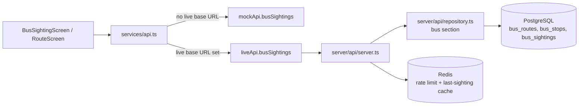
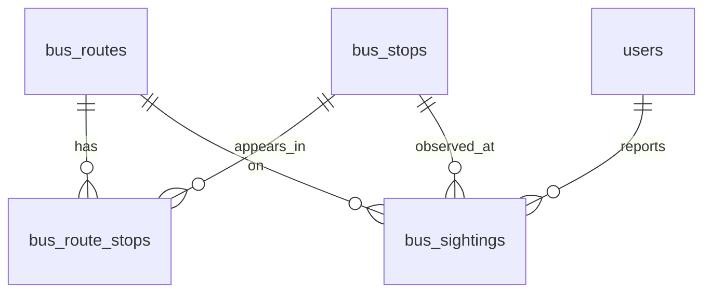

# Happy Bus Archive Design

## Goal

Implement the **Happy Bus Archive** feature from the 2026-05-22 Darolink prototype: a one-tap "I just saw the bus" log that turns informal in-village knowledge ("the D-01 just passed the cafe") into a small shared dataset every Darori resident - including new settlers - can read.

The feature has two user-visible surfaces:

1. **One-tap recorder.** A near-empty screen with a large bus button. Pressing it captures the current timestamp + the user's current location (snapped to the nearest known Happy Bus stop) and appends it as a sighting record. The screen also shows the user's most recent record so they can confirm the press was registered.
2. **Stop-centric history.** On the existing `RouteScreen` (the "버스" tab), each stop card surfaces the time elapsed since the most recent community sighting so a waiting rider can gauge "should I keep waiting?"

This first pass does **not** compute ETA, run reverse-geocoding fallbacks, or send push notifications. Those belong to a follow-up spec.

## Scope

### In scope (this design)

- New `bus_routes`, `bus_stops`, `bus_sightings` tables.
- New write endpoint to record a sighting and new read endpoints to list stops and recent sightings.
- New `services/api.ts` entries with parallel `mockApi.ts` and `liveApi.ts` implementations.
- New mobile screen `BusSightingScreen` and a "최근 목격" badge on existing `RouteScreen` route cards.
- New domain types (`BusRoute`, `BusStop`, `BusSighting`) and seed fixtures.
- Migration `002_bus_archive` added via the existing `readSchemaMigrations()` extension point.

### Explicitly out of scope (deferred to a later spec)

- Real-time ETA prediction (the badge shows raw "X minutes ago", not a forecast).
- Reverse-geocoding sightings that fall outside any known stop radius (we drop them in v1).
- Push notifications when a bus is sighted near a user's watched stop.
- Bus operator real-time GPS feed integration (Cheongdo-gun does not currently expose one).
- Editing or deleting a sighting after the fact. Sightings are append-only.
- Aggregation / smoothing across multiple recent sightings to remove outliers.
- Admin moderation tools for spam sightings.

## Architecture



The feature adds nothing new to the runtime topology. It reuses:

- Existing `requireWriteContext()` for write auth + rate limit.
- Existing `getOptionalRequestUserId()` for reads (reads do not require a user header).
- Existing migration runner; only the migration loader function gains a second file.
- Existing mock/live switching in `services/api.ts`.

## Data Model

Three append-only tables. Stops and routes are reference data seeded once; sightings are user-generated.



### `bus_routes`

The Happy Bus runs a small fixed set of routes (D-01, D-03, etc. - see `RouteScreen` fixtures). One row per route. Seeded, not user-created.

| Column | Type | Notes |
|---|---|---|
| `id` | `text` PK | e.g. `route-d-01` |
| `code` | `text` not null unique | display code, e.g. `D-01` |
| `name` | `text` not null | e.g. `다이루리 순환` |
| `color` | `text` not null | hex used by map polyline; matches existing `RouteOption.color` palette |
| `created_at` | `timestamptz` default `now()` | |

### `bus_stops`

One row per physical stop. Coordinates are stored as plain `numeric` (latitude/longitude) - we do **not** introduce PostGIS in this iteration because the dataset is ~50 rows and a Haversine in TypeScript over an in-memory list is faster to ship and easy to test. PostGIS becomes worthwhile only if we expand to all of Cheongdo-gun.

| Column | Type | Notes |
|---|---|---|
| `id` | `text` PK | e.g. `stop-darori-cafe` |
| `name` | `text` not null | display name, e.g. `다로리 카페` |
| `latitude` | `numeric(9,6)` not null | |
| `longitude` | `numeric(9,6)` not null | |
| `created_at` | `timestamptz` default `now()` | |

### `bus_route_stops`

Many-to-many join (a route visits multiple stops; a stop serves multiple routes). Carries the visit order so the route-stop sequence is preserved.

| Column | Type | Notes |
|---|---|---|
| `route_id` | `text` FK → `bus_routes(id)` on delete cascade | |
| `stop_id` | `text` FK → `bus_stops(id)` on delete cascade | |
| `sequence` | `integer` not null | 1-based position along the route |
| PK | `(route_id, stop_id)` | |
| Unique | `(route_id, sequence)` | one stop per sequence slot |

### `bus_sightings`

Append-only log. **No update, no delete in v1.** A sighting must be associated with both a known stop and a known route (we resolve them at write time - see API section).

| Column | Type | Notes |
|---|---|---|
| `id` | `text` PK | `sighting-{Date.now()}` |
| `route_id` | `text` FK → `bus_routes(id)` on delete restrict | |
| `stop_id` | `text` FK → `bus_stops(id)` on delete restrict | the stop the reporter was closest to |
| `reporter_id` | `text` FK → `users(id)` on delete set null | nullable so user deletion doesn't lose community data. **Never returned to clients** - only used for moderator queries and the `reporter_label` derivation |
| `latitude` | `numeric(9,6)` not null | raw reporter coordinate, kept for audit |
| `longitude` | `numeric(9,6)` not null | raw reporter coordinate |
| `created_at` | `timestamptz` not null default `now()` | sighting time |

**Note on reporter privacy.** The schema keeps `reporter_id` as a plain FK for moderator/admin recovery. Client-facing APIs never echo this column; instead they emit a read-time-derived `reporter_label`. See API Surface > `reporter_label` derivation below.

### Indexes

```sql
create index bus_sightings_stop_created_at_idx
  on bus_sightings(stop_id, created_at desc);

create index bus_sightings_route_created_at_idx
  on bus_sightings(route_id, created_at desc);
```

The first index serves "most recent sighting at this stop" (the badge query). The second serves "recent sightings along this route" (RouteScreen badge cross-stop).

### Redis usage

Two keys per stop:

- `darori:bus:last:{stopId}` - cached most-recent sighting ISO string. Written on every successful POST `/bus/sightings`, read by `GET /bus/stops` listing. `EX 3600`. This avoids a per-stop SQL hit when the listing page renders 20+ stops.
- Rate-limit key `darori:recordBusSighting:{userId}` - existing pattern, see API section.

Redis is a cache only; it is acceptable for the key to be missing - repository falls back to SQL.

## Migration Strategy

Current state: `server/db/migrate.ts` ships a `readSchemaMigrations()` that returns one entry, `001_initial_schema`, whose SQL is the entire `server/db/schema.sql`. Adding the new tables by appending to `schema.sql` would not run on any environment that has already applied `001_initial_schema` (deployed seedboxes, the user's laptop, CI). So we need a second migration file.

**Plan:**

1. Create `server/db/migrations/002_bus_archive.sql` with `create table` statements for `bus_routes`, `bus_stops`, `bus_route_stops`, `bus_sightings`, and indexes listed above.
2. Extend `readSchemaMigrations()` in `server/db/migrate.ts` to also load `server/db/migrations/*.sql`, sorted by filename. The initial schema continues to live at the top level for backward compatibility.
3. The migration table (`schema_migrations`) already keys by `id`, so `002_bus_archive` is recognized as a new entry and applied on the next `npm run db:migrate`.
4. `server/db/seed.ts` gains a Happy Bus seed block (a few routes, ~10 stops, no sightings - sightings are user-generated).

This keeps the migrator's contract intact (one SQL file = one logical migration), introduces no new dependency, and matches the established pattern of "schema-as-files".

## Domain Types

Added to `types/domain.ts`:

```ts
export type BusRoute = {
  id: string;
  code: string;
  name: string;
  color: string;
};

export type BusStop = {
  id: string;
  name: string;
  latitude: number;
  longitude: number;
  /** ISO string of the most recent community sighting, undefined if never reported */
  lastSightingAt?: string;
};

export type BusSighting = {
  id: string;
  routeId: string;
  stopId: string;
  /** 6-char anonymized identifier of the reporter, stable per reporter.
   *  Derived from sha256(reporter_id + DARORI_REPORTER_LABEL_SALT)[0..5].
   *  Used to surface "same person reporting again" patterns without leaking
   *  user IDs or nicknames. The real reporter_id is never sent to clients. */
  reporterLabel: string;
  latitude: number;
  longitude: number;
  createdAt: string;
};
```

These follow the existing camelCase + ISO-string convention from `Post` and `ChatMessage`. `lastSightingAt` is a denormalized read-time field, never written by the client. `reporterLabel` is a server-derived hash, never written by the client and never reversible without the salt.

## API Surface

| Method | Path | Auth | Rate limit | Action |
|---|---|---|---|---|
| `GET` | `/bus/routes` | optional user header | no | `listBusRoutes()` |
| `GET` | `/bus/stops` | optional user header | no | `listBusStops()` - includes `lastSightingAt` |
| `GET` | `/bus/stops/:id/sightings?limit=20` | optional user header | no | `listSightingsForStop(stopId, limit)` |
| `POST` | `/bus/sightings` | required | yes (`recordBusSighting`: 30/min) | `recordBusSighting(body, userId)` |

### `POST /bus/sightings` request body

```json
{
  "routeId": "route-d-01",
  "latitude": 35.6485,
  "longitude": 128.7345
}
```

Behavior:

1. Validate input: `routeId` is required and must resolve to an existing route. Latitude/longitude must be finite numbers in valid ranges.
2. Server resolves the **closest stop** to the reporter coordinate by Haversine distance against the in-memory stop list for that route. If the closest stop is more than `NEAREST_STOP_RADIUS_METERS` away, return `400 { error: "no nearby stop on route" }`.
3. Insert into `bus_sightings`.
4. Update Redis `darori:bus:last:{stopId}` with the new ISO timestamp.
5. Derive `reporterLabel` (see below) and return the inserted `BusSighting` *without* `reporter_id`.

Rate limit: 30 records / 60 s per user - generous so a passing bus can be batch-reported in noisy moments, but tight enough that a stuck-button event cannot fill the table.

A new `BusSightingInputError` class is introduced, mirroring `CreatePostInputError`. The server.ts catch block maps it to `400`.

### Tunable constants

Both the radius and the reporter-label salt live as **module-level exports** in `server/api/busArchive.ts` so they can be tuned without searching the codebase, and both can be overridden via environment variable for deploy-time rotation.

```ts
// server/api/busArchive.ts
export const NEAREST_STOP_RADIUS_METERS = Number(
  process.env.DARORI_BUS_SNAP_RADIUS_M ?? 300,
);

const REPORTER_LABEL_SALT = process.env.DARORI_REPORTER_LABEL_SALT ?? "";
```

| Constant | Env override | Default | Notes |
|---|---|---|---|
| `NEAREST_STOP_RADIUS_METERS` | `DARORI_BUS_SNAP_RADIUS_M` | `300` | Anchored to the prototype-map stop spacing (~400–600 m). Tune after first field data. |
| `REPORTER_LABEL_SALT` | `DARORI_REPORTER_LABEL_SALT` | `""` (empty string - **must be set in production**, code logs a warning at startup if empty) | Salt must be random and at least 32 chars in production. Rotation is free: change the env value and labels for every future sighting change immediately. Past sighting labels rendered to clients before rotation are no longer derivable from the new salt, which is acceptable v1 behavior. |

### `reporter_label` derivation

For every sighting returned by any of the read endpoints, the server computes:

```ts
reporterLabel = createHash("sha256")
  .update(`${reporterId}::${REPORTER_LABEL_SALT}`)
  .digest("hex")
  .slice(0, 6);
```

Properties:

- **Stable per reporter** with a fixed salt - the same user always produces the same 6-char label until the salt is rotated. This is the property the user asked for: "if a reporter keeps filing suspicious sightings, we can see it's the same person."
- **Not reversible** without the salt - even with the full sightings table, an attacker cannot link labels back to user IDs.
- **Salt rotation is cheap** - labels are computed at read time, no DB writes needed. A rotation invalidates the link between old labels (already shown in app sessions) and new labels (everything from this moment on), which is the desired moderator-recovery posture.
- **Collision is ignorable at our scale** - 6 hex chars = 24 bits = ~16M unique labels. Darori village has on the order of hundreds of potential reporters; collision probability is well under 0.001%.

If `reporter_id` is null (because the user account was deleted), `reporter_label` is `"deleted"`.

A helper `reporterLabel(reporterId: string | null): string` is exported from `server/api/busArchive.ts` so the same logic is reused in `listSightingsForStop` and `recordBusSighting` responses, and mock-mode parity is one-line.

### `GET /bus/stops`

Returns all stops with `lastSightingAt` populated from Redis (with SQL fallback). Sorted by stop `id` for determinism. No pagination in v1 (dataset is tiny).

### `GET /bus/stops/:id/sightings`

Returns up to `limit` (default 20, max 100) most recent sightings for a stop, newest first. Used for the "최근 기록" panel on the BusSightingScreen prototype's right-side view.

## Mobile Behavior

### `BusSightingScreen` (new)

Matches the prototype's two-state mock:

- **Idle state:** large rounded button with bus icon centered. Above it: "방금 버스 봤어요!" headline and the live clock. Below: "현위치: {stop name}" chip showing the resolved nearest stop (or "위치 확인 중…" while geolocation is loading).
- **After press:** button briefly flashes, a "최근 기록" card appears showing the inserted sighting's time and stop name. Subsequent presses replace the recent-record block. We keep the last 5 in-memory for the session as a visual confirmation history (not persisted client-side beyond the session).

Entry point: a floating "방금 버스 봤어요" action button in the existing `RouteScreen` header (the "버스" tab). Tapping pushes `BusSightingScreen` as a sub-screen. Exit returns to `RouteScreen`. This matches the existing pattern (see `MapScreen` → `PostDetailScreen` push in `App.tsx`).

### `RouteScreen` augmentation

Each existing route card gets a small badge: "마지막 목격 6분 전" when a sighting from that route exists within the last 60 minutes; nothing rendered otherwise. The badge consumes the same `GET /bus/stops` result already needed for the new feature, so RouteScreen does not gain a new fetch - it adds the existing fetch.

### Geolocation

We use `expo-location` (added as a new dependency per the Decisions Log). **This is the only new mobile dependency the feature requires.** Behavior:

- Request foreground location permission on screen mount.
- If granted, watch position with `Location.watchPositionAsync` and use the latest reading for the next button press.
- If denied, show a yellow inline notice: "위치 권한이 없으면 정류장을 자동으로 인식할 수 없어요. 설정에서 허용해 주세요." The button is disabled in this state.

The geolocation reading is sent raw to the server; stop snapping happens server-side so all clients agree on what "the nearest stop" means.

### Mock mode

`mockApi.busSightings`:

- Seeds `bus_routes` (3 routes) and `bus_stops` (8 stops) in `data/mockDomain.ts`.
- Seeds 4–6 historical sightings so badges have content on first launch.
- `recordBusSighting` runs the same Haversine snap locally so the mock behavior matches live behavior.

## Mock/Live Mode

`services/api.ts` gains five new pass-throughs:

```ts
export const getBusRoutes = (...args) => activeApi().getBusRoutes(...args);
export const getBusStops = (...args) => activeApi().getBusStops(...args);
export const getStopSightings = (...args) => activeApi().getStopSightings(...args);
export const recordBusSighting = (...args) => activeApi().recordBusSighting(...args);
```

`liveApi.ts` uses the existing `apiClient` helper. `mockApi.ts` stores sightings in `mockDb.ts` so they survive tab navigation within a session.

## Edge Cases

| Case | Behavior |
|---|---|
| User presses the button while location is still loading | Button is disabled until first fix arrives; tooltip "위치를 가져오는 중이에요" |
| User is outside any stop's 300 m radius | `400 { error: "no nearby stop on route" }` → UI shows "지금 위치에서는 정류장을 찾을 수 없어요" toast and does not record |
| User presses the button twice within 5 seconds | Both records are accepted (rate limit is generous). Client-side debounce of 1 s prevents pure double-taps from one press. |
| Geolocation accuracy is poor (e.g. 200 m horizontal accuracy) | Still record. v1 trusts the reporter; we will revisit accuracy filtering once we have data. |
| Offline at press time | Record is **dropped**, not queued. v1 explicitly does not implement an outbox. UI shows "오프라인 상태에서는 기록할 수 없어요". |
| `routeId` does not exist | `400 { error: "route not found" }` |
| Reporter user is later deleted | `reporter_id` is set to null; the sighting itself stays. Community data outlives individual accounts. |
| Two users press within the same second for the same stop | Both rows are inserted; `bus_sightings_stop_created_at_idx` still serves "latest" in O(log n). |
| Two different reporters happen to share the same 6-char label | Acceptable. At ~16M label space vs. hundreds of likely reporters, the birthday-paradox probability is well under 0.001%. A label is a hint to moderators, not an identity claim. |
| `DARORI_REPORTER_LABEL_SALT` is unset in production | `busArchive.ts` logs a one-time warning at first call. Labels are still deterministic (salt = `""`) but offer no protection against an attacker who controls the codebase. CI/deploy checklist needs a separate item to enforce this. |

## Testing

Following the existing `__tests__/` conventions:

| Test file | Type | Coverage |
|---|---|---|
| `__tests__/serverBusSighting.test.ts` | server unit | `recordBusSighting()` input validation: missing routeId, out-of-range coords, no nearby stop. Pure-function variant (no DB) using injected stops. |
| `__tests__/serverBusRouteSnap.test.ts` | server unit | Haversine stop-snapping picks the right stop within radius; rejects beyond `NEAREST_STOP_RADIUS_METERS`; respects `DARORI_BUS_SNAP_RADIUS_M` override. |
| `__tests__/serverReporterLabel.test.ts` | server unit | Stable label for same reporter + salt; different label after salt rotation; `"deleted"` for null reporter; 6-char output. |
| `__tests__/BusSightingScreen.test.tsx` | screen | Renders idle state, disabled state on permission denial, "방금 기록됨" card on successful press. Mocks `expo-location` and `services/api`. |
| `__tests__/mockBusSightings.test.ts` | data | Mock store accepts a sighting, returns it in `getStopSightings`, updates `lastSightingAt` on `getBusStops`, and computes `reporterLabel` consistently with the server module. |
| `__tests__/serverMigrationPlan.test.ts` | existing - extend | Verify `002_bus_archive` is included after `001_initial_schema` and that ordering is stable. |

No e2e or integration tests in this pass; they are gated on the live mode being wired against a real DB in CI, which is itself out of scope.

## Dependencies

| Dependency | Where | Why | Approved |
|---|---|---|---|
| `expo-location` | mobile app | Foreground location permission + position watch for the recorder screen. Smallest sensible choice for Expo geolocation. | 2026-05-22 |
| (no new server deps) | server | Haversine + sha256 are stdlib; no PostGIS, no crypto library beyond `node:crypto`. | - |

## Decisions Log

Resolved on 2026-05-22 in response to the design-review questions:

1. **`expo-location` approved** as the geolocation source. No manual fallback picker in v1.
2. **Stop snap radius = 300 m**, exposed as `NEAREST_STOP_RADIUS_METERS` constant overridable by `DARORI_BUS_SNAP_RADIUS_M`. Revisit after first field data; no Darori field measurement available yet.
3. **Entry point**: floating action button on the `RouteScreen` header that pushes `BusSightingScreen` as a sub-screen (matches the existing `MapScreen → PostDetailScreen` push pattern in `App.tsx`). No bottom-nav change, no new tab.
4. **Reporter attribution = stable hash label, not nickname.** Clients receive `reporterLabel = sha256(reporter_id + DARORI_REPORTER_LABEL_SALT)[0..5]` (e.g. `"3a7f"`). The same reporter always produces the same label under a given salt, enabling moderators and observant residents to spot a reporter who keeps filing suspicious sightings - without ever exposing the underlying user ID, nickname, or contact. Salt rotation is free because labels are computed at read time. See API Surface > `reporter_label` derivation for the full rule.
5. **Seed data**: 3 routes (D-01, D-03, D-05) + 8 stops with **mock coordinates**, because no Darori field survey is available yet. A `TODO` comment in `002_bus_archive.sql` / `seedData.ts` marks the rows for replacement once real coordinates arrive.
